# Mask_RCNN-master007
基于mask_rcnn的目标检测案例，本地win10系统CPU测试通过，踩过很多坑，填坑方法均已给出，
可训练自定义数据集，需要增加“样本集数量”和调试“超参数”来提供准确率。
本项目源码对应的csdn地址：https://mp.csdn.net/mp_blog/creation/editor/118832615

**请注意：原来的数据集过于简单，只有c和m两个分类，共14张图片；本版本往后，替换成管道缺陷检测数据集，共338张图片，12个分类**

参考资料：https://blog.csdn.net/hhhuua/article/details/107569039
1.版本信息
python 3.6.9
Tensorflow 1.15.0
keras  2.2.5
Pillow 5.3.0（必须，否则labelme执行json_to_dataset会出错）
Cv2（必须安装，训练模型时用到）
Wrapt
opt_einsum
Gast
scikit-image
IPython

虚拟环境完整配置库如下：

(py36_maskrcnn_env) C:\Users\DELL>pip list
WARNING: Ignoring invalid distribution -ip (f:\programfiles\anaconda3\envs\py36_maskrcnn_env\lib\site-packages)
Package                  Version
------------------------ -------------------
absl-py                  0.13.0
astor                    0.8.1
astunparse               1.6.3
backcall                 0.2.0
bleach                   1.5.0
cached-property          1.5.2
cachetools               4.2.2
certifi                  2021.5.30
chardet                  4.0.0
colorama                 0.4.4
cycler                   0.10.0
dataclasses              0.8
decorator                4.4.2
enum34                   1.1.10
flatbuffers              1.12
gast                     0.2.2
google-auth              1.32.1
google-auth-oauthlib     0.4.4
google-pasta             0.2.0
grpcio                   1.32.0
h5py                     2.10.0
html5lib                 0.9999999
idna                     2.10
imageio                  2.9.0
imgviz                   1.2.6
importlib-metadata       4.6.0
ipython                  7.16.1
ipython-genutils         0.2.0
jedi                     0.18.0
Keras                    2.2.5
Keras-Applications       1.0.8
keras-nightly            2.5.0.dev2021032900
Keras-Preprocessing      1.1.2
kiwisolver               1.3.1
labelme                  4.5.9
Markdown                 3.3.4
matplotlib               3.2.2
networkx                 2.5.1
numpy                    1.19.5
oauthlib                 3.1.1
object-detection         0.1
opencv-python            4.5.2.54
opt-einsum               3.3.0
parso                    0.8.2
pickleshare              0.7.5
Pillow                   5.3.0
pip                      21.1.3
prompt-toolkit           3.0.19
protobuf                 3.17.3
pyasn1                   0.4.8
pyasn1-modules           0.2.8
Pygments                 2.9.0
pyparsing                2.4.7
PyQt5                    5.15.2
PyQt5-sip                12.9.0
python-dateutil          2.8.1
PyWavelets               1.1.1
PyYAML                   5.4.1
QtPy                     1.9.0
requests                 2.25.1
requests-oauthlib        1.3.0
rsa                      4.7.2
scikit-image             0.16.2
scipy                    1.4.1
setuptools               52.0.0.post20210125
six                      1.15.0
tensorboard              1.15.0
tensorboard-data-server  0.6.1
tensorboard-plugin-wit   1.8.0
tensorflow               1.15.0
tensorflow-estimator     1.15.1
tensorflow-gpu           2.2.0
tensorflow-gpu-estimator 2.2.0
termcolor                1.1.0
tifffile                 2020.9.3
traitlets                4.3.3
typing-extensions        3.7.4.3
urllib3                  1.26.6
wcwidth                  0.2.5
Werkzeug                 2.0.1
wheel                    0.36.2
wincertstore             0.2
wrapt                    1.12.1
zipp                     3.4.1
WARNING: Ignoring invalid distribution -ip (f:\programfiles\anaconda3\envs\py36_maskrcnn_env\lib\site-packages)
WARNING: Ignoring invalid distribution -ip (f:\programfiles\anaconda3\envs\py36_maskrcnn_env\lib\site-packages)

2.labelme中的json_to_dataset.py修改源代码，新版本中加入旧版本的yaml部分代码；

3.新建一个pic、json、train_data和transform_json文件夹，用labelme打标注；

4.用右键“Run makedir”或命令“python makedir.py”生成四个子目录文件夹；

5.将json文件转换为模型需要的mask文件
https://blog.csdn.net/weixin_44826203/article/details/105692190 
使用的是labelme的labelme_json_to_dataset函数。

6.rename_cv2_mask.py ，复制label.png，并改名；

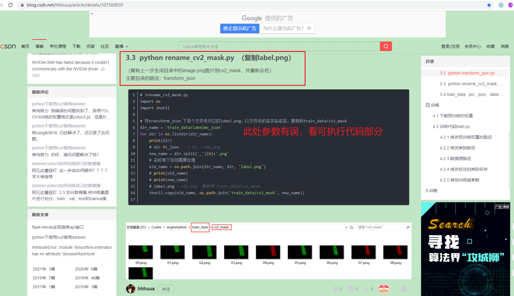

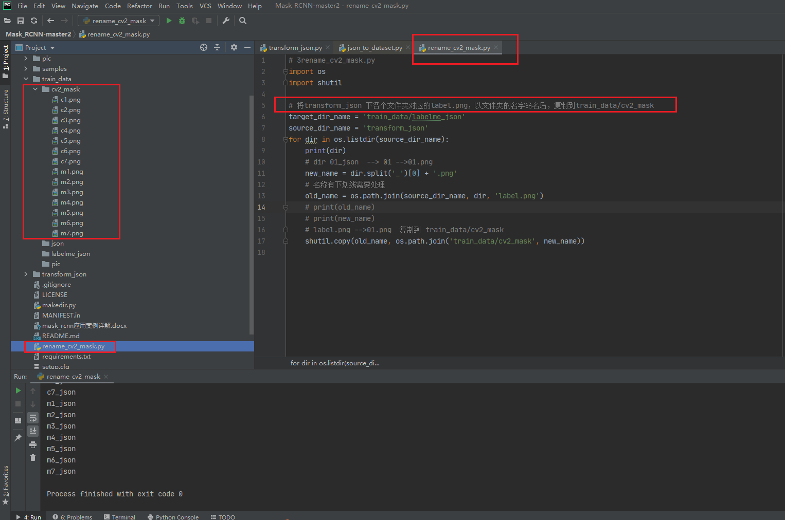

7.将pic、json放到对应的train_data下pic、json，将transform_json下面的json文件夹都复制到train_data/labelme_json路径下。
https://blog.csdn.net/hhhuua/article/details/107569039 

8.下载mask_rcnn_coco.h5,放到根目录下

9.新增文件train.py，注意修改相应参数；
https://blog.csdn.net/hhhuua/article/details/107569039 

在工作区右键点选“Run ’train’”开始模型训练；

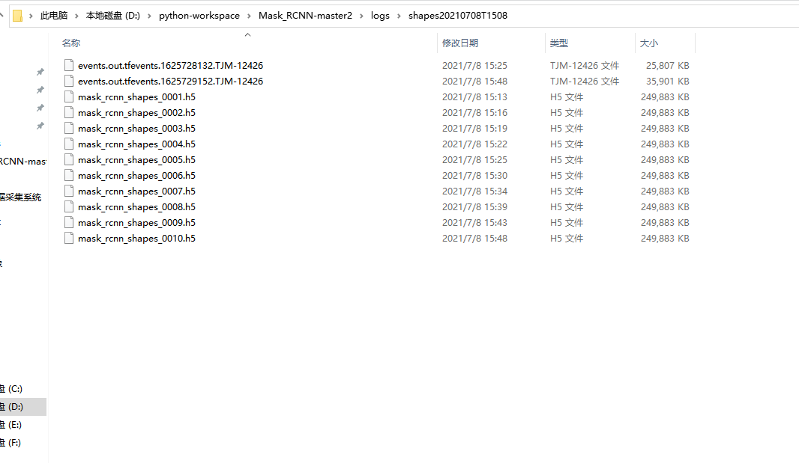

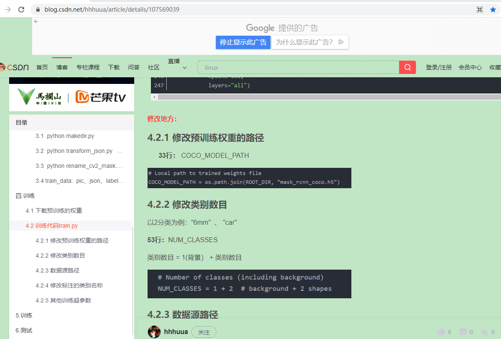

10.启动tensorboard，命令行是： tensorboard --logdir=log路径。
https://blog.csdn.net/fuqiuai/article/details/83997275 
cmd命令：tensorboard --logdir=shapes20210707T1008

查看tensorboard可视化界面：http://localhost:6006/#scalars 

管道缺陷数据集（338张）：

11.测试模型：运行 Run‘test’;
https://blog.csdn.net/doudou_here/article/details/87855273 

检测结果出现很多框，是由于模型相关参数不正确引起的，需要多次尝试参数。

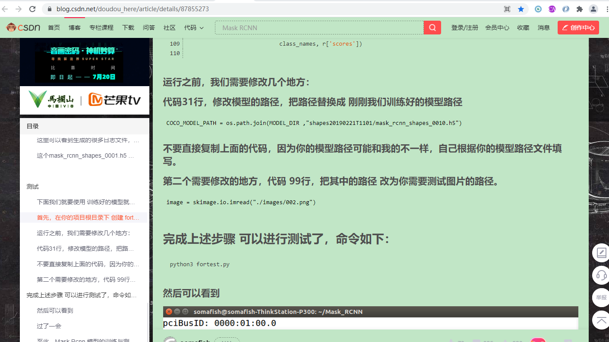

运行 Run ’test2’:

 管道数据集测试结果如下：
 

*问题总结*：
1. 将json文件转换为模型需要的mask文件，需要修改labelme源码，D:\Anaconda3\Lib\site-packages\labelme\cli\json_to_dataset.py

返回空文件夹，是因为路径问题；
解决方法：
https://blog.csdn.net/yql_617540298/article/details/111041776
更改json_to_dataset.py源码，且修改路径。

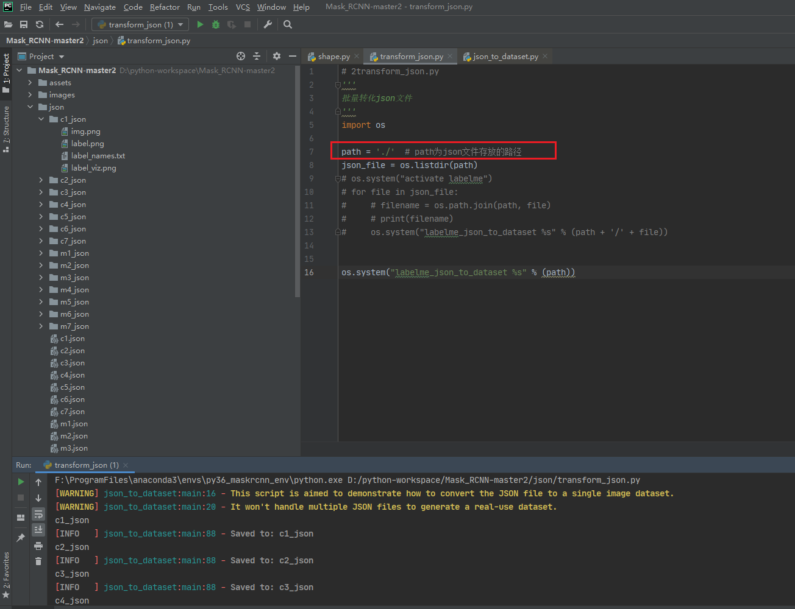

2.问题：UnicodeDecodeError: 'gbk' codec can't decode byte 0xac in position 35: illegal multibyte sequence

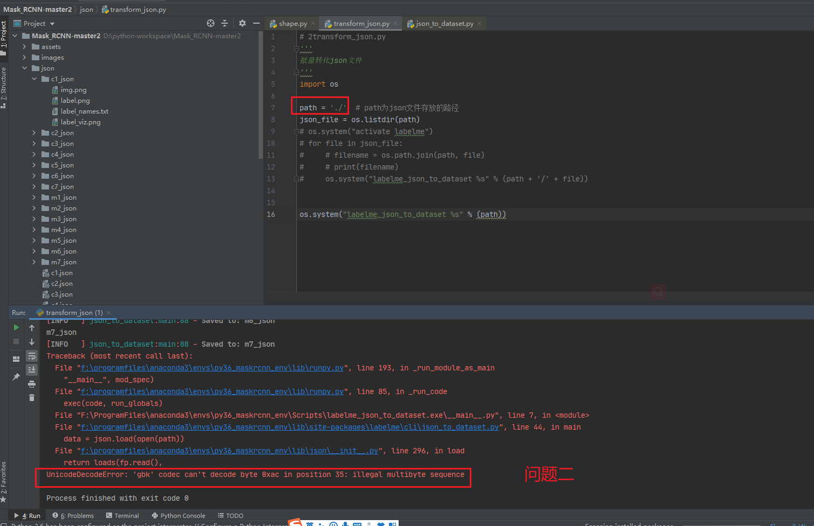

解决方法：
https://blog.csdn.net/weixin_41931602/article/details/80557416

3.问题：json_to_dataset.py不生成info.yaml文件；

解决方法：
https://blog.csdn.net/hhhuua/article/details/107569039 

4.问题：AttributeError: ‘Model‘ object has no attribute ‘metrics_tensors‘，AttributeError: module 'tensorflow' has no attribute 'placeholder'，类似问题都是tensorflow与keras的版本不匹配导致的。

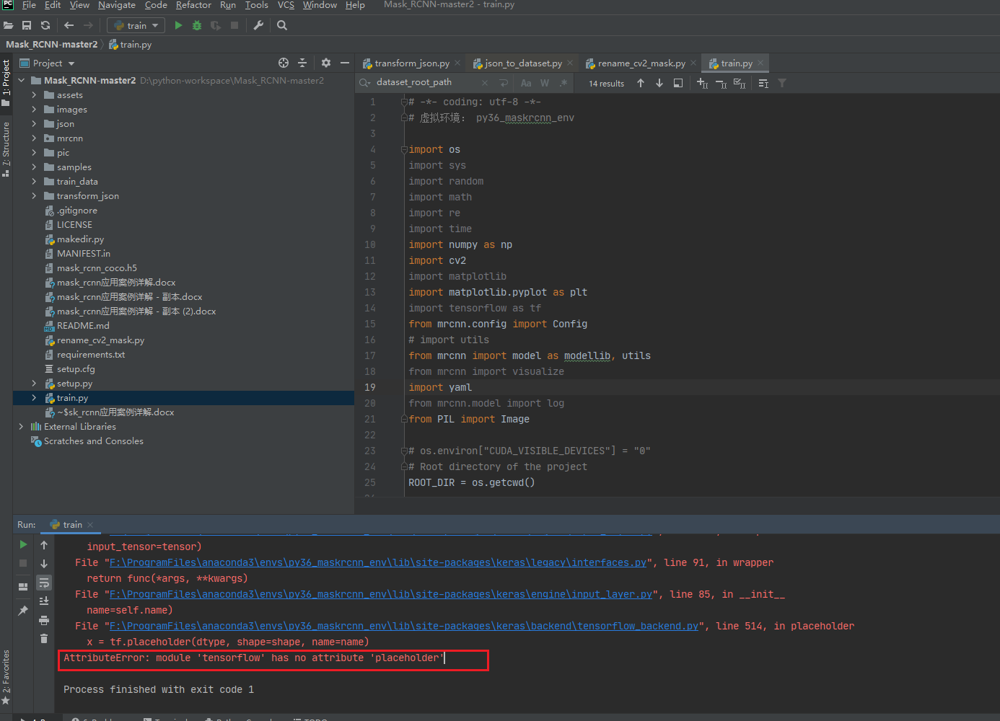

解决方法：
https://blog.csdn.net/u013066730/article/details/109071869  
Tensorflow=1.15.0
Keras=2.2.5

5.问题：测试.h5模型代码test.py出错，ValueError: Layer #391 (named "mrcnn_bbox_fc"), weight <tf.Variable 'mrcnn_bbox_fc_1/kernel:0' shape=(1024, 8) dtype=float32_ref> has shape (1024, 8), but the saved weight has shape (1024, 12).

解决方法：
https://blog.csdn.net/qq_34713831/article/details/85797622 

6.问题：执行 Run ‘train.py’训练模型时，提示警告信息：F:\ProgramFiles\anaconda3\envs\py36_maskrcnn_env\lib\site-packages\skimage\transform\_warps.py:830: FutureWarning: Input image dtype is bool. Interpolation is not defined with bool data type. Please set order to 0 or explicitely cast input image to another data type. Starting from version 0.19 a ValueError will be raised instead of this warning.
  order = _validate_interpolation_order(image.dtype, order)
  

  
解决方法：
Maybe you can try the skimage version 0.16.2。when I use the version 0.17.2， I faced the same issue.Good luck!Idont know why.
pip install -U scikit-image==0.16.2

https://stackoverflow.com/questions/62330374/input-image-dtype-is-bool-interpolation-is-not-defined-with-bool-data-type 

  
7.问题：运行train.py，训练模型时，有警告提示：

image_id 4
D:/python-workspace/Mask_RCNN-master2/train.py:89: YAMLLoadWarning: calling yaml.load() without Loader=... is deprecated, as the default Loader is unsafe. Please read https://msg.pyyaml.org/load for full details.
  temp = yaml.load(f.read())  
  
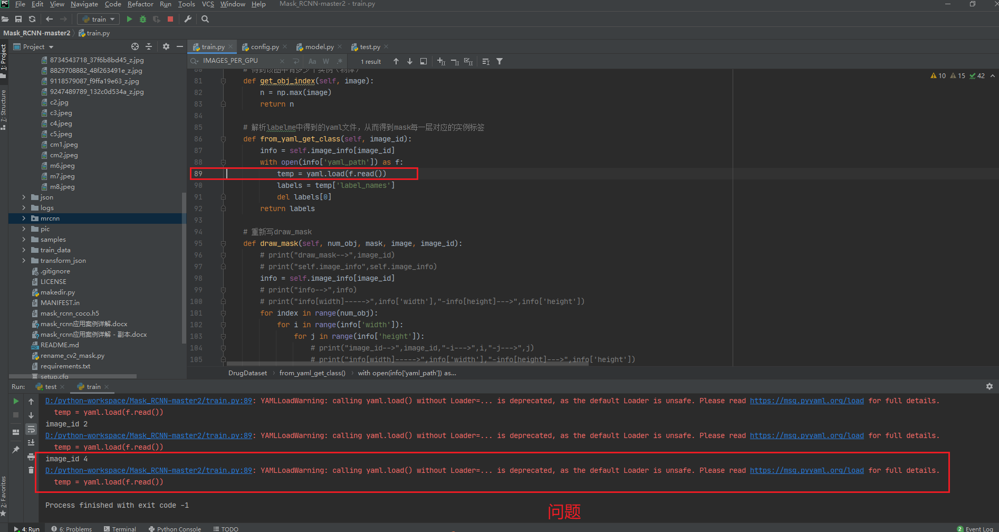
  
解决方法：
https://blog.csdn.net/rp517045939/article/details/88838417 

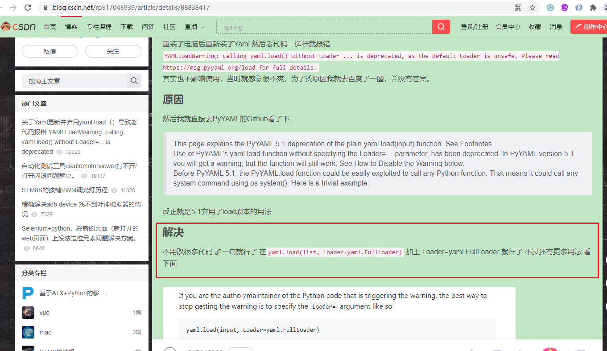

  

8.执行transform_json.py文件，将json文件转换为模型需要的mask文件时，报错。
json.decoder.JSONDecodeError: Expecting value: line 1 column 1 (char 0)
  
 

解决方法：

 

 

 

9.问题：AttributeError: module 'tensorboard.plugins.pr_curve.summary' has no attribute 'pb'

 

解决方法：
参考资料：https://www.jianshu.com/p/1cd9fe04f5ae 

 

10.问题：IndexError: boolean index did not match indexed array along dimension 0; dimension is 0 but corresponding boolean dimension is 1

 

解决方法：

 

11.问题：module 'tensorflow' has no attribute 'placeholder'

 

解决方法：
参考资料：https://zhuanlan.zhihu.com/p/262180446 

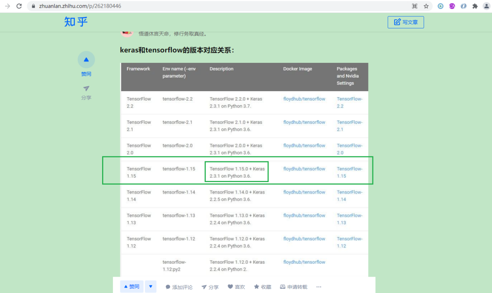 

12.问题：'Model' object has no attribute 'metrics_tensors'

 

解决方法：
参考资料：https://blog.csdn.net/qq_43381010/article/details/104550241 

 

  
  
