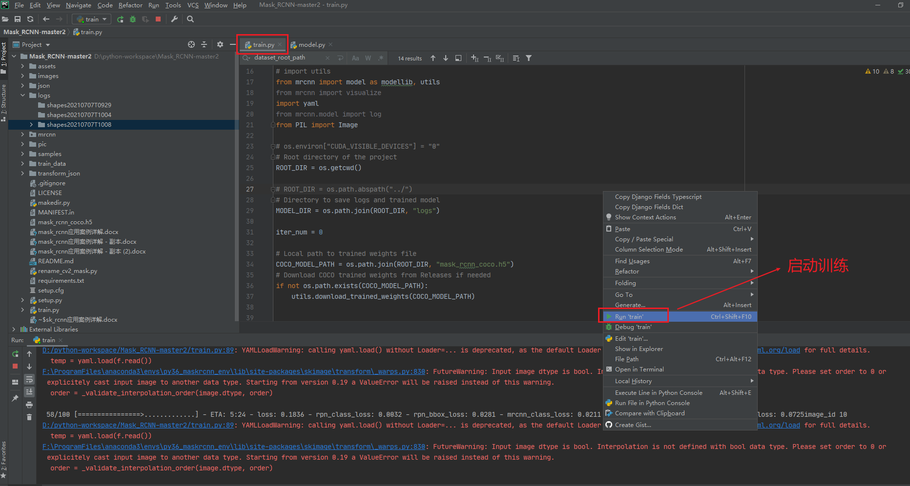
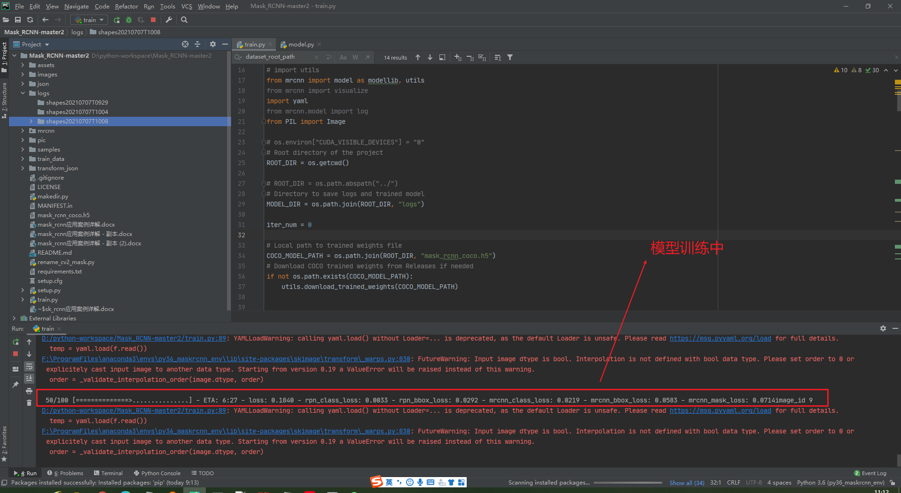
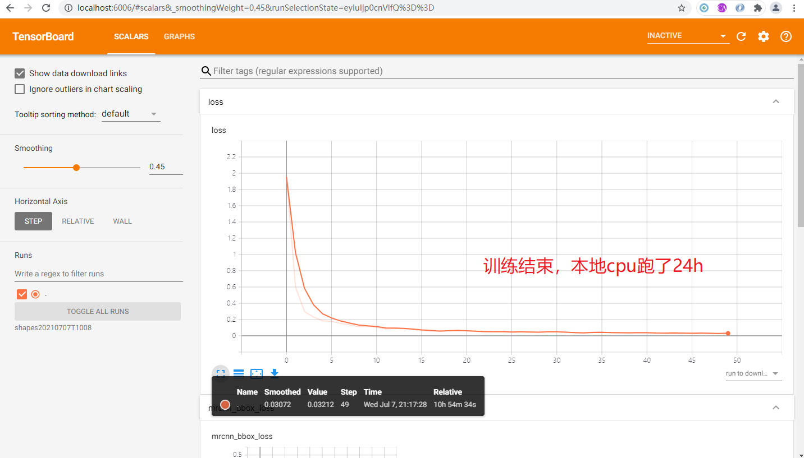
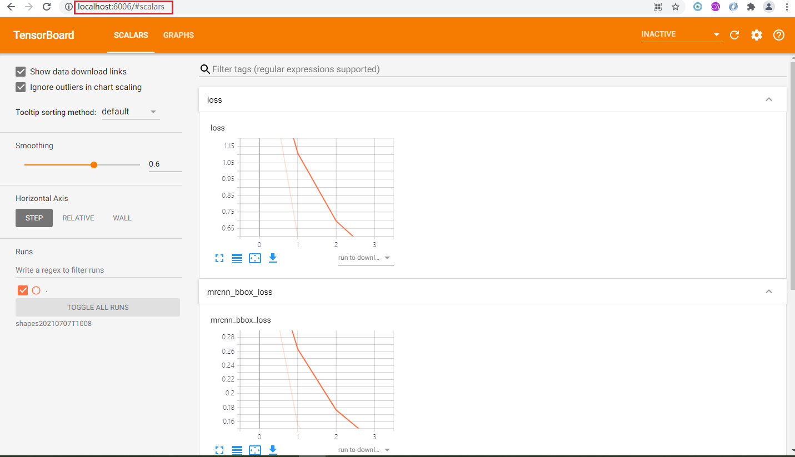
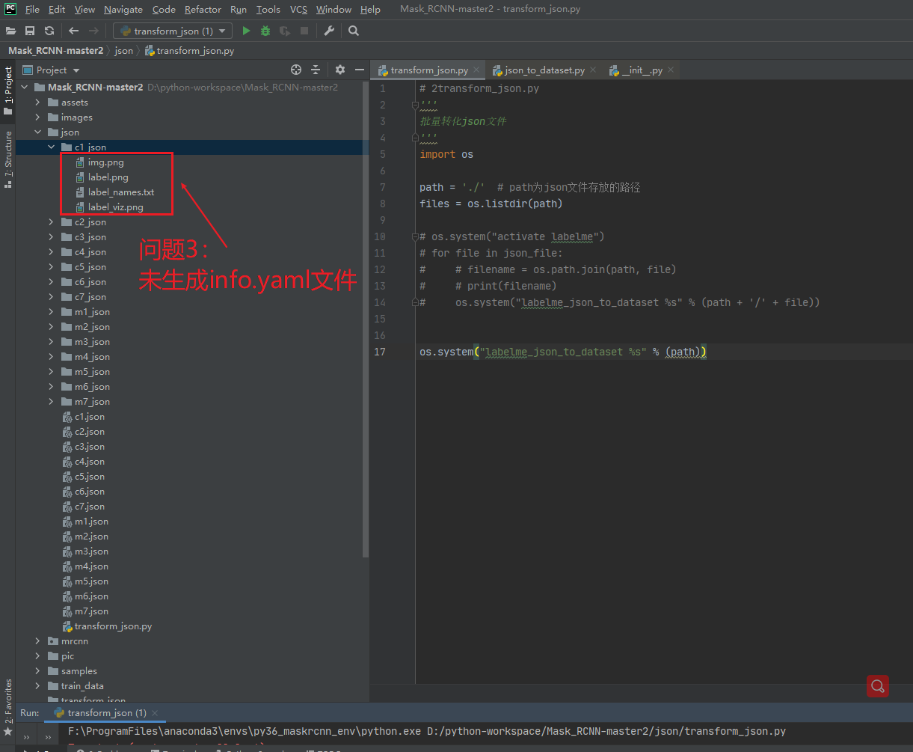
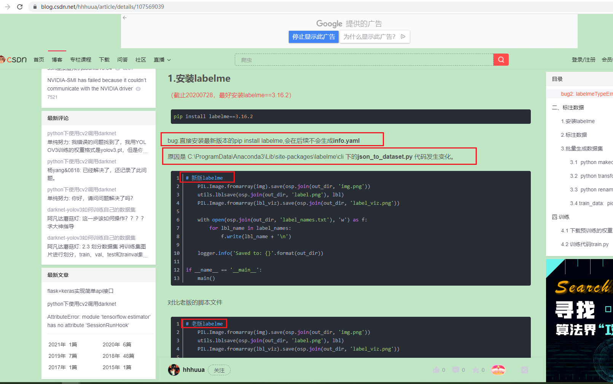
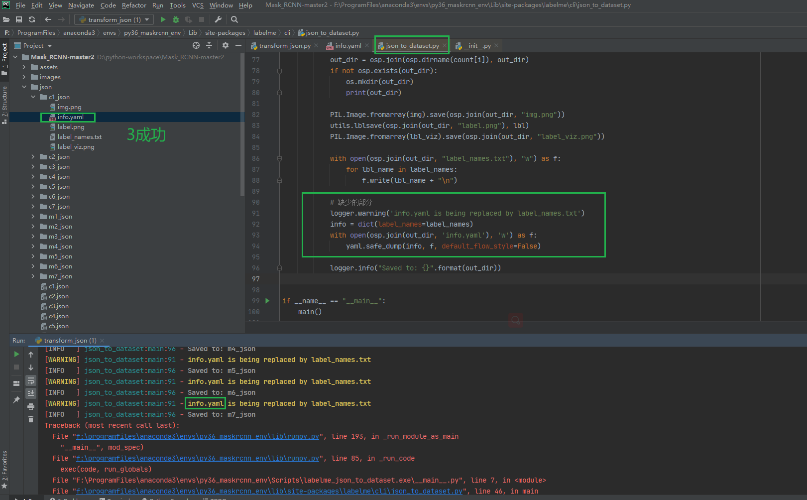
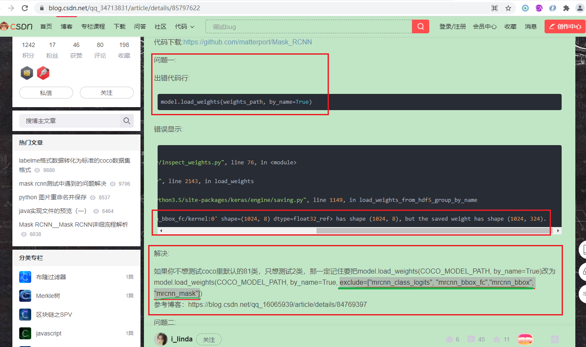
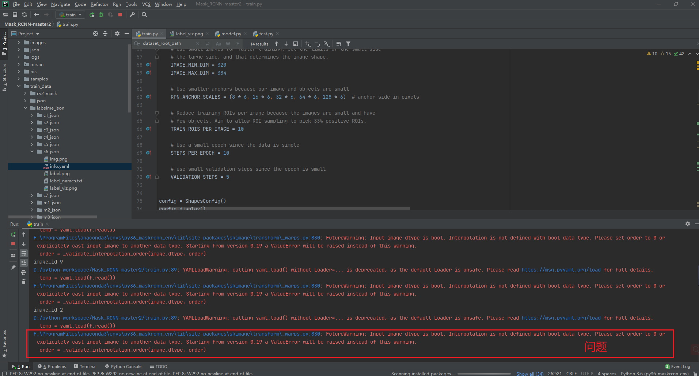

# Mask_RCNN-master007
<html xmlns:o="urn:schemas-microsoft-com:office:office" xmlns:w="urn:schemas-microsoft-com:office:word" xmlns:dt="uuid:C2F41010-65B3-11d1-A29F-00AA00C14882" xmlns="http://www.w3.org/TR/REC-html40"><head><meta http-equiv=Content-Type  content="text/html; charset=gb2312" ><meta name=ProgId  content=Word.Document ><meta name=Generator  content="Microsoft Word 14" ><meta name=Originator  content="Microsoft Word 14" ><title></title><!--[if gte mso 9]><xml><o:DocumentProperties><o:Author>DELL</o:Author><o:LastAuthor>DELL</o:LastAuthor><o:Revision>1</o:Revision><o:Pages>1</o:Pages><o:Lines>1</o:Lines><o:Paragraphs>1</o:Paragraphs></o:DocumentProperties><o:CustomDocumentProperties><o:KSOProductBuildVer dt:dt="string" >2052-11.1.0.10578</o:KSOProductBuildVer><o:ICV dt:dt="string" >7E6D0AAAB7DE4544B7123DA01859DE36</o:ICV></o:CustomDocumentProperties></xml><![endif]--><!--[if gte mso 9]><xml><o:OfficeDocumentSettings></o:OfficeDocumentSettings></xml><![endif]--><!--[if gte mso 9]><xml><w:WordDocument><w:BrowserLevel>MicrosoftInternetExplorer4</w:BrowserLevel><w:DisplayHorizontalDrawingGridEvery>0</w:DisplayHorizontalDrawingGridEvery><w:DisplayVerticalDrawingGridEvery>2</w:DisplayVerticalDrawingGridEvery><w:DocumentKind>DocumentNotSpecified</w:DocumentKind><w:DrawingGridVerticalSpacing>7.8 磅</w:DrawingGridVerticalSpacing><w:View>Web</w:View><w:Compatibility><w:AdjustLineHeightInTable/><w:DontGrowAutofit/><w:BalanceSingleByteDoubleByteWidth/><w:DoNotExpandShiftReturn/><w:UseFELayout/></w:Compatibility><w:Zoom>0</w:Zoom></w:WordDocument></xml><![endif]--><!--[if gte mso 9]><xml><w:LatentStyles DefLockedState="false"  DefUnhideWhenUsed="true"  DefSemiHidden="true"  DefQFormat="false"  DefPriority="99"  LatentStyleCount="260" >
<w:LsdException Locked="false"  Priority="99"  SemiHidden="false"  Name="Normal" ></w:LsdException>
<w:LsdException Locked="false"  Priority="0"  SemiHidden="false"  UnhideWhenUsed="false"  QFormat="true"  Name="heading 1" ></w:LsdException>
<w:LsdException Locked="false"  Priority="0"  SemiHidden="false"  UnhideWhenUsed="false"  QFormat="true"  Name="heading 2" ></w:LsdException>
<w:LsdException Locked="false"  Priority="0"  SemiHidden="false"  UnhideWhenUsed="false"  QFormat="true"  Name="heading 3" ></w:LsdException>
<w:LsdException Locked="false"  Priority="0"  SemiHidden="false"  UnhideWhenUsed="false"  QFormat="true"  Name="heading 4" ></w:LsdException>
<w:LsdException Locked="false"  Priority="0"  SemiHidden="false"  UnhideWhenUsed="false"  QFormat="true"  Name="heading 5" ></w:LsdException>
<w:LsdException Locked="false"  Priority="0"  SemiHidden="false"  UnhideWhenUsed="false"  QFormat="true"  Name="heading 6" ></w:LsdException>
<w:LsdException Locked="false"  Priority="0"  SemiHidden="false"  UnhideWhenUsed="false"  QFormat="true"  Name="heading 7" ></w:LsdException>
<w:LsdException Locked="false"  Priority="0"  SemiHidden="false"  UnhideWhenUsed="false"  QFormat="true"  Name="heading 8" ></w:LsdException>
<w:LsdException Locked="false"  Priority="0"  SemiHidden="false"  UnhideWhenUsed="false"  QFormat="true"  Name="heading 9" ></w:LsdException>
<w:LsdException Locked="false"  Priority="0"  SemiHidden="false"  UnhideWhenUsed="false"  Name="index 1" ></w:LsdException>
<w:LsdException Locked="false"  Priority="0"  SemiHidden="false"  UnhideWhenUsed="false"  Name="index 2" ></w:LsdException>
<w:LsdException Locked="false"  Priority="0"  SemiHidden="false"  UnhideWhenUsed="false"  Name="index 3" ></w:LsdException>
<w:LsdException Locked="false"  Priority="0"  SemiHidden="false"  UnhideWhenUsed="false"  Name="index 4" ></w:LsdException>
<w:LsdException Locked="false"  Priority="0"  SemiHidden="false"  UnhideWhenUsed="false"  Name="index 5" ></w:LsdException>
<w:LsdException Locked="false"  Priority="0"  SemiHidden="false"  UnhideWhenUsed="false"  Name="index 6" ></w:LsdException>
<w:LsdException Locked="false"  Priority="0"  SemiHidden="false"  UnhideWhenUsed="false"  Name="index 7" ></w:LsdException>
<w:LsdException Locked="false"  Priority="0"  SemiHidden="false"  UnhideWhenUsed="false"  Name="index 8" ></w:LsdException>
<w:LsdException Locked="false"  Priority="0"  SemiHidden="false"  UnhideWhenUsed="false"  Name="index 9" ></w:LsdException>
<w:LsdException Locked="false"  Priority="0"  SemiHidden="false"  UnhideWhenUsed="false"  Name="toc 1" ></w:LsdException>
<w:LsdException Locked="false"  Priority="0"  SemiHidden="false"  UnhideWhenUsed="false"  Name="toc 2" ></w:LsdException>
<w:LsdException Locked="false"  Priority="0"  SemiHidden="false"  UnhideWhenUsed="false"  Name="toc 3" ></w:LsdException>
<w:LsdException Locked="false"  Priority="0"  SemiHidden="false"  UnhideWhenUsed="false"  Name="toc 4" ></w:LsdException>
<w:LsdException Locked="false"  Priority="0"  SemiHidden="false"  UnhideWhenUsed="false"  Name="toc 5" ></w:LsdException>
<w:LsdException Locked="false"  Priority="0"  SemiHidden="false"  UnhideWhenUsed="false"  Name="toc 6" ></w:LsdException>
<w:LsdException Locked="false"  Priority="0"  SemiHidden="false"  UnhideWhenUsed="false"  Name="toc 7" ></w:LsdException>
<w:LsdException Locked="false"  Priority="0"  SemiHidden="false"  UnhideWhenUsed="false"  Name="toc 8" ></w:LsdException>
<w:LsdException Locked="false"  Priority="0"  SemiHidden="false"  UnhideWhenUsed="false"  Name="toc 9" ></w:LsdException>
<w:LsdException Locked="false"  Priority="0"  SemiHidden="false"  UnhideWhenUsed="false"  Name="Normal Indent" ></w:LsdException>
<w:LsdException Locked="false"  Priority="0"  SemiHidden="false"  UnhideWhenUsed="false"  Name="footnote text" ></w:LsdException>
<w:LsdException Locked="false"  Priority="0"  SemiHidden="false"  UnhideWhenUsed="false"  Name="annotation text" ></w:LsdException>
<w:LsdException Locked="false"  Priority="0"  SemiHidden="false"  UnhideWhenUsed="false"  Name="header" ></w:LsdException>
<w:LsdException Locked="false"  Priority="0"  SemiHidden="false"  UnhideWhenUsed="false"  Name="footer" ></w:LsdException>
<w:LsdException Locked="false"  Priority="0"  SemiHidden="false"  UnhideWhenUsed="false"  Name="index heading" ></w:LsdException>
<w:LsdException Locked="false"  Priority="0"  SemiHidden="false"  UnhideWhenUsed="false"  QFormat="true"  Name="caption" ></w:LsdException>
<w:LsdException Locked="false"  Priority="0"  SemiHidden="false"  UnhideWhenUsed="false"  Name="table of figures" ></w:LsdException>
<w:LsdException Locked="false"  Priority="0"  SemiHidden="false"  UnhideWhenUsed="false"  Name="envelope address" ></w:LsdException>
<w:LsdException Locked="false"  Priority="0"  SemiHidden="false"  UnhideWhenUsed="false"  Name="envelope return" ></w:LsdException>
<w:LsdException Locked="false"  Priority="0"  SemiHidden="false"  UnhideWhenUsed="false"  Name="footnote reference" ></w:LsdException>
<w:LsdException Locked="false"  Priority="0"  SemiHidden="false"  UnhideWhenUsed="false"  Name="annotation reference" ></w:LsdException>
<w:LsdException Locked="false"  Priority="0"  SemiHidden="false"  UnhideWhenUsed="false"  Name="line number" ></w:LsdException>
<w:LsdException Locked="false"  Priority="0"  SemiHidden="false"  UnhideWhenUsed="false"  Name="page number" ></w:LsdException>
<w:LsdException Locked="false"  Priority="0"  SemiHidden="false"  UnhideWhenUsed="false"  Name="endnote reference" ></w:LsdException>
<w:LsdException Locked="false"  Priority="0"  SemiHidden="false"  UnhideWhenUsed="false"  Name="endnote text" ></w:LsdException>
<w:LsdException Locked="false"  Priority="0"  SemiHidden="false"  UnhideWhenUsed="false"  Name="table of authorities" ></w:LsdException>
<w:LsdException Locked="false"  Priority="0"  SemiHidden="false"  UnhideWhenUsed="false"  Name="macro" ></w:LsdException>
<w:LsdException Locked="false"  Priority="0"  SemiHidden="false"  UnhideWhenUsed="false"  Name="toa heading" ></w:LsdException>
<w:LsdException Locked="false"  Priority="0"  SemiHidden="false"  UnhideWhenUsed="false"  Name="List" ></w:LsdException>
<w:LsdException Locked="false"  Priority="0"  SemiHidden="false"  UnhideWhenUsed="false"  Name="List Bullet" ></w:LsdException>
<w:LsdException Locked="false"  Priority="0"  SemiHidden="false"  UnhideWhenUsed="false"  Name="List Number" ></w:LsdException>
<w:LsdException Locked="false"  Priority="0"  SemiHidden="false"  UnhideWhenUsed="false"  Name="List 2" ></w:LsdException>
<w:LsdException Locked="false"  Priority="0"  SemiHidden="false"  UnhideWhenUsed="false"  Name="List 3" ></w:LsdException>
<w:LsdException Locked="false"  Priority="0"  SemiHidden="false"  UnhideWhenUsed="false"  Name="List 4" ></w:LsdException>
<w:LsdException Locked="false"  Priority="0"  SemiHidden="false"  UnhideWhenUsed="false"  Name="List 5" ></w:LsdException>
<w:LsdException Locked="false"  Priority="0"  SemiHidden="false"  UnhideWhenUsed="false"  Name="List Bullet 2" ></w:LsdException>
<w:LsdException Locked="false"  Priority="0"  SemiHidden="false"  UnhideWhenUsed="false"  Name="List Bullet 3" ></w:LsdException>
<w:LsdException Locked="false"  Priority="0"  SemiHidden="false"  UnhideWhenUsed="false"  Name="List Bullet 4" ></w:LsdException>
<w:LsdException Locked="false"  Priority="0"  SemiHidden="false"  UnhideWhenUsed="false"  Name="List Bullet 5" ></w:LsdException>
<w:LsdException Locked="false"  Priority="0"  SemiHidden="false"  UnhideWhenUsed="false"  Name="List Number 2" ></w:LsdException>
<w:LsdException Locked="false"  Priority="0"  SemiHidden="false"  UnhideWhenUsed="false"  Name="List Number 3" ></w:LsdException>
<w:LsdException Locked="false"  Priority="0"  SemiHidden="false"  UnhideWhenUsed="false"  Name="List Number 4" ></w:LsdException>
<w:LsdException Locked="false"  Priority="0"  SemiHidden="false"  UnhideWhenUsed="false"  Name="List Number 5" ></w:LsdException>
<w:LsdException Locked="false"  Priority="0"  SemiHidden="false"  UnhideWhenUsed="false"  QFormat="true"  Name="Title" ></w:LsdException>
<w:LsdException Locked="false"  Priority="0"  SemiHidden="false"  UnhideWhenUsed="false"  Name="Closing" ></w:LsdException>
<w:LsdException Locked="false"  Priority="0"  SemiHidden="false"  UnhideWhenUsed="false"  Name="Signature" ></w:LsdException>
<w:LsdException Locked="false"  Priority="99"  SemiHidden="false"  Name="Default Paragraph Font" ></w:LsdException>
<w:LsdException Locked="false"  Priority="0"  SemiHidden="false"  UnhideWhenUsed="false"  Name="Body Text" ></w:LsdException>
<w:LsdException Locked="false"  Priority="0"  SemiHidden="false"  UnhideWhenUsed="false"  Name="Body Text Indent" ></w:LsdException>
<w:LsdException Locked="false"  Priority="0"  SemiHidden="false"  UnhideWhenUsed="false"  Name="List Continue" ></w:LsdException>
<w:LsdException Locked="false"  Priority="0"  SemiHidden="false"  UnhideWhenUsed="false"  Name="List Continue 2" ></w:LsdException>
<w:LsdException Locked="false"  Priority="0"  SemiHidden="false"  UnhideWhenUsed="false"  Name="List Continue 3" ></w:LsdException>
<w:LsdException Locked="false"  Priority="0"  SemiHidden="false"  UnhideWhenUsed="false"  Name="List Continue 4" ></w:LsdException>
<w:LsdException Locked="false"  Priority="0"  SemiHidden="false"  UnhideWhenUsed="false"  Name="List Continue 5" ></w:LsdException>
<w:LsdException Locked="false"  Priority="0"  SemiHidden="false"  UnhideWhenUsed="false"  Name="Message Header" ></w:LsdException>
<w:LsdException Locked="false"  Priority="0"  SemiHidden="false"  UnhideWhenUsed="false"  QFormat="true"  Name="Subtitle" ></w:LsdException>
<w:LsdException Locked="false"  Priority="0"  SemiHidden="false"  UnhideWhenUsed="false"  Name="Salutation" ></w:LsdException>
<w:LsdException Locked="false"  Priority="0"  SemiHidden="false"  UnhideWhenUsed="false"  Name="Date" ></w:LsdException>
<w:LsdException Locked="false"  Priority="0"  SemiHidden="false"  UnhideWhenUsed="false"  Name="Body Text First Indent" ></w:LsdException>
<w:LsdException Locked="false"  Priority="0"  SemiHidden="false"  UnhideWhenUsed="false"  Name="Body Text First Indent 2" ></w:LsdException>
<w:LsdException Locked="false"  Priority="0"  SemiHidden="false"  UnhideWhenUsed="false"  Name="Note Heading" ></w:LsdException>
<w:LsdException Locked="false"  Priority="0"  SemiHidden="false"  UnhideWhenUsed="false"  Name="Body Text 2" ></w:LsdException>
<w:LsdException Locked="false"  Priority="0"  SemiHidden="false"  UnhideWhenUsed="false"  Name="Body Text 3" ></w:LsdException>
<w:LsdException Locked="false"  Priority="0"  SemiHidden="false"  UnhideWhenUsed="false"  Name="Body Text Indent 2" ></w:LsdException>
<w:LsdException Locked="false"  Priority="0"  SemiHidden="false"  UnhideWhenUsed="false"  Name="Body Text Indent 3" ></w:LsdException>
<w:LsdException Locked="false"  Priority="0"  SemiHidden="false"  UnhideWhenUsed="false"  Name="Block Text" ></w:LsdException>
<w:LsdException Locked="false"  Priority="0"  SemiHidden="false"  UnhideWhenUsed="false"  QFormat="true"  Name="Hyperlink" ></w:LsdException>
<w:LsdException Locked="false"  Priority="0"  SemiHidden="false"  UnhideWhenUsed="false"  Name="FollowedHyperlink" ></w:LsdException>
<w:LsdException Locked="false"  Priority="0"  SemiHidden="false"  UnhideWhenUsed="false"  QFormat="true"  Name="Strong" ></w:LsdException>
<w:LsdException Locked="false"  Priority="0"  SemiHidden="false"  UnhideWhenUsed="false"  QFormat="true"  Name="Emphasis" ></w:LsdException>
<w:LsdException Locked="false"  Priority="0"  SemiHidden="false"  UnhideWhenUsed="false"  Name="Document Map" ></w:LsdException>
<w:LsdException Locked="false"  Priority="0"  SemiHidden="false"  UnhideWhenUsed="false"  Name="Plain Text" ></w:LsdException>
<w:LsdException Locked="false"  Priority="0"  SemiHidden="false"  UnhideWhenUsed="false"  Name="E-mail Signature" ></w:LsdException>
<w:LsdException Locked="false"  Priority="0"  SemiHidden="false"  UnhideWhenUsed="false"  QFormat="true"  Name="Normal (Web)" ></w:LsdException>
<w:LsdException Locked="false"  Priority="0"  SemiHidden="false"  UnhideWhenUsed="false"  Name="HTML Acronym" ></w:LsdException>
<w:LsdException Locked="false"  Priority="0"  SemiHidden="false"  UnhideWhenUsed="false"  Name="HTML Address" ></w:LsdException>
<w:LsdException Locked="false"  Priority="0"  SemiHidden="false"  UnhideWhenUsed="false"  Name="HTML Cite" ></w:LsdException>
<w:LsdException Locked="false"  Priority="0"  SemiHidden="false"  UnhideWhenUsed="false"  Name="HTML Code" ></w:LsdException>
<w:LsdException Locked="false"  Priority="0"  SemiHidden="false"  UnhideWhenUsed="false"  Name="HTML Definition" ></w:LsdException>
<w:LsdException Locked="false"  Priority="0"  SemiHidden="false"  UnhideWhenUsed="false"  Name="HTML Keyboard" ></w:LsdException>
<w:LsdException Locked="false"  Priority="0"  SemiHidden="false"  UnhideWhenUsed="false"  Name="HTML Preformatted" ></w:LsdException>
<w:LsdException Locked="false"  Priority="0"  SemiHidden="false"  UnhideWhenUsed="false"  Name="HTML Sample" ></w:LsdException>
<w:LsdException Locked="false"  Priority="0"  SemiHidden="false"  UnhideWhenUsed="false"  Name="HTML Typewriter" ></w:LsdException>
<w:LsdException Locked="false"  Priority="0"  SemiHidden="false"  UnhideWhenUsed="false"  Name="HTML Variable" ></w:LsdException>
<w:LsdException Locked="false"  Priority="99"  SemiHidden="false"  Name="Normal Table" ></w:LsdException>
<w:LsdException Locked="false"  Priority="0"  SemiHidden="false"  UnhideWhenUsed="false"  Name="annotation subject" ></w:LsdException>
<w:LsdException Locked="false"  Priority="99"  SemiHidden="false"  Name="No List" ></w:LsdException>
<w:LsdException Locked="false"  Priority="99"  SemiHidden="false"  Name="1 / a / i" ></w:LsdException>
<w:LsdException Locked="false"  Priority="99"  SemiHidden="false"  Name="1 / 1.1 / 1.1.1" ></w:LsdException>
<w:LsdException Locked="false"  Priority="99"  SemiHidden="false"  Name="Article / Section" ></w:LsdException>
<w:LsdException Locked="false"  Priority="99"  SemiHidden="false"  Name="Table Simple 1" ></w:LsdException>
<w:LsdException Locked="false"  Priority="99"  SemiHidden="false"  Name="Table Simple 2" ></w:LsdException>
<w:LsdException Locked="false"  Priority="99"  SemiHidden="false"  Name="Table Simple 3" ></w:LsdException>
<w:LsdException Locked="false"  Priority="99"  SemiHidden="false"  Name="Table Classic 1" ></w:LsdException>
<w:LsdException Locked="false"  Priority="99"  SemiHidden="false"  Name="Table Classic 2" ></w:LsdException>
<w:LsdException Locked="false"  Priority="99"  SemiHidden="false"  Name="Table Classic 3" ></w:LsdException>
<w:LsdException Locked="false"  Priority="99"  SemiHidden="false"  Name="Table Classic 4" ></w:LsdException>
<w:LsdException Locked="false"  Priority="99"  SemiHidden="false"  Name="Table Colorful 1" ></w:LsdException>
<w:LsdException Locked="false"  Priority="99"  SemiHidden="false"  Name="Table Colorful 2" ></w:LsdException>
<w:LsdException Locked="false"  Priority="99"  SemiHidden="false"  Name="Table Colorful 3" ></w:LsdException>
<w:LsdException Locked="false"  Priority="99"  SemiHidden="false"  Name="Table Columns 1" ></w:LsdException>
<w:LsdException Locked="false"  Priority="99"  SemiHidden="false"  Name="Table Columns 2" ></w:LsdException>
<w:LsdException Locked="false"  Priority="99"  SemiHidden="false"  Name="Table Columns 3" ></w:LsdException>
<w:LsdException Locked="false"  Priority="99"  SemiHidden="false"  Name="Table Columns 4" ></w:LsdException>
<w:LsdException Locked="false"  Priority="99"  SemiHidden="false"  Name="Table Columns 5" ></w:LsdException>
<w:LsdException Locked="false"  Priority="99"  SemiHidden="false"  Name="Table Grid 1" ></w:LsdException>
<w:LsdException Locked="false"  Priority="99"  SemiHidden="false"  Name="Table Grid 2" ></w:LsdException>
<w:LsdException Locked="false"  Priority="99"  SemiHidden="false"  Name="Table Grid 3" ></w:LsdException>
<w:LsdException Locked="false"  Priority="99"  SemiHidden="false"  Name="Table Grid 4" ></w:LsdException>
<w:LsdException Locked="false"  Priority="99"  SemiHidden="false"  Name="Table Grid 5" ></w:LsdException>
<w:LsdException Locked="false"  Priority="99"  SemiHidden="false"  Name="Table Grid 6" ></w:LsdException>
<w:LsdException Locked="false"  Priority="99"  SemiHidden="false"  Name="Table Grid 7" ></w:LsdException>
<w:LsdException Locked="false"  Priority="99"  SemiHidden="false"  Name="Table Grid 8" ></w:LsdException>
<w:LsdException Locked="false"  Priority="99"  SemiHidden="false"  Name="Table List 1" ></w:LsdException>
<w:LsdException Locked="false"  Priority="99"  SemiHidden="false"  Name="Table List 2" ></w:LsdException>
<w:LsdException Locked="false"  Priority="99"  SemiHidden="false"  Name="Table List 3" ></w:LsdException>
<w:LsdException Locked="false"  Priority="99"  SemiHidden="false"  Name="Table List 4" ></w:LsdException>
<w:LsdException Locked="false"  Priority="99"  SemiHidden="false"  Name="Table List 5" ></w:LsdException>
<w:LsdException Locked="false"  Priority="99"  SemiHidden="false"  Name="Table List 6" ></w:LsdException>
<w:LsdException Locked="false"  Priority="99"  SemiHidden="false"  Name="Table List 7" ></w:LsdException>
<w:LsdException Locked="false"  Priority="99"  SemiHidden="false"  Name="Table List 8" ></w:LsdException>
<w:LsdException Locked="false"  Priority="99"  SemiHidden="false"  Name="Table 3D effects 1" ></w:LsdException>
<w:LsdException Locked="false"  Priority="99"  SemiHidden="false"  Name="Table 3D effects 2" ></w:LsdException>
<w:LsdException Locked="false"  Priority="99"  SemiHidden="false"  Name="Table 3D effects 3" ></w:LsdException>
<w:LsdException Locked="false"  Priority="99"  SemiHidden="false"  Name="Table Contemporary" ></w:LsdException>
<w:LsdException Locked="false"  Priority="99"  SemiHidden="false"  Name="Table Elegant" ></w:LsdException>
<w:LsdException Locked="false"  Priority="99"  SemiHidden="false"  Name="Table Professional" ></w:LsdException>
<w:LsdException Locked="false"  Priority="99"  SemiHidden="false"  Name="Table Subtle 1" ></w:LsdException>
<w:LsdException Locked="false"  Priority="99"  SemiHidden="false"  Name="Table Subtle 2" ></w:LsdException>
<w:LsdException Locked="false"  Priority="99"  SemiHidden="false"  Name="Table Web 1" ></w:LsdException>
<w:LsdException Locked="false"  Priority="99"  SemiHidden="false"  Name="Table Web 2" ></w:LsdException>
<w:LsdException Locked="false"  Priority="99"  SemiHidden="false"  Name="Table Web 3" ></w:LsdException>
<w:LsdException Locked="false"  Priority="0"  SemiHidden="false"  UnhideWhenUsed="false"  Name="Balloon Text" ></w:LsdException>
<w:LsdException Locked="false"  Priority="99"  SemiHidden="false"  Name="Table Grid" ></w:LsdException>
<w:LsdException Locked="false"  Priority="99"  SemiHidden="false"  Name="Table Theme" ></w:LsdException>
<w:LsdException Locked="false"  Priority="99"  SemiHidden="false"  Name="Placeholder Text" ></w:LsdException>
<w:LsdException Locked="false"  Priority="99"  SemiHidden="false"  Name="No Spacing" ></w:LsdException>
<w:LsdException Locked="false"  Priority="99"  SemiHidden="false"  Name="Light Shading" ></w:LsdException>
<w:LsdException Locked="false"  Priority="99"  SemiHidden="false"  Name="Light List" ></w:LsdException>
<w:LsdException Locked="false"  Priority="99"  SemiHidden="false"  Name="Light Grid" ></w:LsdException>
<w:LsdException Locked="false"  Priority="99"  SemiHidden="false"  Name="Medium Shading 1" ></w:LsdException>
<w:LsdException Locked="false"  Priority="99"  SemiHidden="false"  Name="Medium Shading 2" ></w:LsdException>
<w:LsdException Locked="false"  Priority="99"  SemiHidden="false"  Name="Medium List 1" ></w:LsdException>
<w:LsdException Locked="false"  Priority="99"  SemiHidden="false"  Name="Medium List 2" ></w:LsdException>
<w:LsdException Locked="false"  Priority="99"  SemiHidden="false"  Name="Medium Grid 1" ></w:LsdException>
<w:LsdException Locked="false"  Priority="99"  SemiHidden="false"  Name="Medium Grid 2" ></w:LsdException>
<w:LsdException Locked="false"  Priority="99"  SemiHidden="false"  Name="Medium Grid 3" ></w:LsdException>
<w:LsdException Locked="false"  Priority="99"  SemiHidden="false"  Name="Dark List" ></w:LsdException>
<w:LsdException Locked="false"  Priority="99"  SemiHidden="false"  Name="Colorful Shading" ></w:LsdException>
<w:LsdException Locked="false"  Priority="99"  SemiHidden="false"  Name="Colorful List" ></w:LsdException>
<w:LsdException Locked="false"  Priority="99"  SemiHidden="false"  Name="Colorful Grid" ></w:LsdException>
<w:LsdException Locked="false"  Priority="99"  SemiHidden="false"  Name="Light Shading Accent 1" ></w:LsdException>
<w:LsdException Locked="false"  Priority="99"  SemiHidden="false"  Name="Light List Accent 1" ></w:LsdException>
<w:LsdException Locked="false"  Priority="99"  SemiHidden="false"  Name="Light Grid Accent 1" ></w:LsdException>
<w:LsdException Locked="false"  Priority="99"  SemiHidden="false"  Name="Medium Shading 1 Accent 1" ></w:LsdException>
<w:LsdException Locked="false"  Priority="99"  SemiHidden="false"  Name="Medium Shading 2 Accent 1" ></w:LsdException>
<w:LsdException Locked="false"  Priority="99"  SemiHidden="false"  Name="Medium List 1 Accent 1" ></w:LsdException>
<w:LsdException Locked="false"  Priority="99"  SemiHidden="false"  Name="List Paragraph" ></w:LsdException>
<w:LsdException Locked="false"  Priority="99"  SemiHidden="false"  Name="Quote" ></w:LsdException>
<w:LsdException Locked="false"  Priority="99"  SemiHidden="false"  Name="Intense Quote" ></w:LsdException>
<w:LsdException Locked="false"  Priority="99"  SemiHidden="false"  Name="Medium List 2 Accent 1" ></w:LsdException>
<w:LsdException Locked="false"  Priority="99"  SemiHidden="false"  Name="Medium Grid 1 Accent 1" ></w:LsdException>
<w:LsdException Locked="false"  Priority="99"  SemiHidden="false"  Name="Medium Grid 2 Accent 1" ></w:LsdException>
<w:LsdException Locked="false"  Priority="99"  SemiHidden="false"  Name="Medium Grid 3 Accent 1" ></w:LsdException>
<w:LsdException Locked="false"  Priority="99"  SemiHidden="false"  Name="Dark List Accent 1" ></w:LsdException>
<w:LsdException Locked="false"  Priority="99"  SemiHidden="false"  Name="Colorful Shading Accent 1" ></w:LsdException>
<w:LsdException Locked="false"  Priority="99"  SemiHidden="false"  Name="Colorful List Accent 1" ></w:LsdException>
<w:LsdException Locked="false"  Priority="99"  SemiHidden="false"  Name="Colorful Grid Accent 1" ></w:LsdException>
<w:LsdException Locked="false"  Priority="99"  SemiHidden="false"  Name="Light Shading Accent 2" ></w:LsdException>
<w:LsdException Locked="false"  Priority="99"  SemiHidden="false"  Name="Light List Accent 2" ></w:LsdException>
<w:LsdException Locked="false"  Priority="99"  SemiHidden="false"  Name="Light Grid Accent 2" ></w:LsdException>
<w:LsdException Locked="false"  Priority="99"  SemiHidden="false"  Name="Medium Shading 1 Accent 2" ></w:LsdException>
<w:LsdException Locked="false"  Priority="99"  SemiHidden="false"  Name="Medium Shading 2 Accent 2" ></w:LsdException>
<w:LsdException Locked="false"  Priority="99"  SemiHidden="false"  Name="Medium List 1 Accent 2" ></w:LsdException>
<w:LsdException Locked="false"  Priority="99"  SemiHidden="false"  Name="Medium List 2 Accent 2" ></w:LsdException>
<w:LsdException Locked="false"  Priority="99"  SemiHidden="false"  Name="Medium Grid 1 Accent 2" ></w:LsdException>
<w:LsdException Locked="false"  Priority="99"  SemiHidden="false"  Name="Medium Grid 2 Accent 2" ></w:LsdException>
<w:LsdException Locked="false"  Priority="99"  SemiHidden="false"  Name="Medium Grid 3 Accent 2" ></w:LsdException>
<w:LsdException Locked="false"  Priority="99"  SemiHidden="false"  Name="Dark List Accent 2" ></w:LsdException>
<w:LsdException Locked="false"  Priority="99"  SemiHidden="false"  Name="Colorful Shading Accent 2" ></w:LsdException>
<w:LsdException Locked="false"  Priority="99"  SemiHidden="false"  Name="Colorful List Accent 2" ></w:LsdException>
<w:LsdException Locked="false"  Priority="99"  SemiHidden="false"  Name="Colorful Grid Accent 2" ></w:LsdException>
<w:LsdException Locked="false"  Priority="99"  SemiHidden="false"  Name="Light Shading Accent 3" ></w:LsdException>
<w:LsdException Locked="false"  Priority="99"  SemiHidden="false"  Name="Light List Accent 3" ></w:LsdException>
<w:LsdException Locked="false"  Priority="99"  SemiHidden="false"  Name="Light Grid Accent 3" ></w:LsdException>
<w:LsdException Locked="false"  Priority="99"  SemiHidden="false"  Name="Medium Shading 1 Accent 3" ></w:LsdException>
<w:LsdException Locked="false"  Priority="99"  SemiHidden="false"  Name="Medium Shading 2 Accent 3" ></w:LsdException>
<w:LsdException Locked="false"  Priority="99"  SemiHidden="false"  Name="Medium List 1 Accent 3" ></w:LsdException>
<w:LsdException Locked="false"  Priority="99"  SemiHidden="false"  Name="Medium List 2 Accent 3" ></w:LsdException>
<w:LsdException Locked="false"  Priority="99"  SemiHidden="false"  Name="Medium Grid 1 Accent 3" ></w:LsdException>
<w:LsdException Locked="false"  Priority="99"  SemiHidden="false"  Name="Medium Grid 2 Accent 3" ></w:LsdException>
<w:LsdException Locked="false"  Priority="99"  SemiHidden="false"  Name="Medium Grid 3 Accent 3" ></w:LsdException>
<w:LsdException Locked="false"  Priority="99"  SemiHidden="false"  Name="Dark List Accent 3" ></w:LsdException>
<w:LsdException Locked="false"  Priority="99"  SemiHidden="false"  Name="Colorful Shading Accent 3" ></w:LsdException>
<w:LsdException Locked="false"  Priority="99"  SemiHidden="false"  Name="Colorful List Accent 3" ></w:LsdException>
<w:LsdException Locked="false"  Priority="99"  SemiHidden="false"  Name="Colorful Grid Accent 3" ></w:LsdException>
<w:LsdException Locked="false"  Priority="99"  SemiHidden="false"  Name="Light Shading Accent 4" ></w:LsdException>
<w:LsdException Locked="false"  Priority="99"  SemiHidden="false"  Name="Light List Accent 4" ></w:LsdException>
<w:LsdException Locked="false"  Priority="99"  SemiHidden="false"  Name="Light Grid Accent 4" ></w:LsdException>
<w:LsdException Locked="false"  Priority="99"  SemiHidden="false"  Name="Medium Shading 1 Accent 4" ></w:LsdException>
<w:LsdException Locked="false"  Priority="99"  SemiHidden="false"  Name="Medium Shading 2 Accent 4" ></w:LsdException>
<w:LsdException Locked="false"  Priority="99"  SemiHidden="false"  Name="Medium List 1 Accent 4" ></w:LsdException>
<w:LsdException Locked="false"  Priority="99"  SemiHidden="false"  Name="Medium List 2 Accent 4" ></w:LsdException>
<w:LsdException Locked="false"  Priority="99"  SemiHidden="false"  Name="Medium Grid 1 Accent 4" ></w:LsdException>
<w:LsdException Locked="false"  Priority="99"  SemiHidden="false"  Name="Medium Grid 2 Accent 4" ></w:LsdException>
<w:LsdException Locked="false"  Priority="99"  SemiHidden="false"  Name="Medium Grid 3 Accent 4" ></w:LsdException>
<w:LsdException Locked="false"  Priority="99"  SemiHidden="false"  Name="Dark List Accent 4" ></w:LsdException>
<w:LsdException Locked="false"  Priority="99"  SemiHidden="false"  Name="Colorful Shading Accent 4" ></w:LsdException>
<w:LsdException Locked="false"  Priority="99"  SemiHidden="false"  Name="Colorful List Accent 4" ></w:LsdException>
<w:LsdException Locked="false"  Priority="99"  SemiHidden="false"  Name="Colorful Grid Accent 4" ></w:LsdException>
<w:LsdException Locked="false"  Priority="99"  SemiHidden="false"  Name="Light Shading Accent 5" ></w:LsdException>
<w:LsdException Locked="false"  Priority="99"  SemiHidden="false"  Name="Light List Accent 5" ></w:LsdException>
<w:LsdException Locked="false"  Priority="99"  SemiHidden="false"  Name="Light Grid Accent 5" ></w:LsdException>
<w:LsdException Locked="false"  Priority="99"  SemiHidden="false"  Name="Medium Shading 1 Accent 5" ></w:LsdException>
<w:LsdException Locked="false"  Priority="99"  SemiHidden="false"  Name="Medium Shading 2 Accent 5" ></w:LsdException>
<w:LsdException Locked="false"  Priority="99"  SemiHidden="false"  Name="Medium List 1 Accent 5" ></w:LsdException>
<w:LsdException Locked="false"  Priority="99"  SemiHidden="false"  Name="Medium List 2 Accent 5" ></w:LsdException>
<w:LsdException Locked="false"  Priority="99"  SemiHidden="false"  Name="Medium Grid 1 Accent 5" ></w:LsdException>
<w:LsdException Locked="false"  Priority="99"  SemiHidden="false"  Name="Medium Grid 2 Accent 5" ></w:LsdException>
<w:LsdException Locked="false"  Priority="99"  SemiHidden="false"  Name="Medium Grid 3 Accent 5" ></w:LsdException>
<w:LsdException Locked="false"  Priority="99"  SemiHidden="false"  Name="Dark List Accent 5" ></w:LsdException>
<w:LsdException Locked="false"  Priority="99"  SemiHidden="false"  Name="Colorful Shading Accent 5" ></w:LsdException>
<w:LsdException Locked="false"  Priority="99"  SemiHidden="false"  Name="Colorful List Accent 5" ></w:LsdException>
<w:LsdException Locked="false"  Priority="99"  SemiHidden="false"  Name="Colorful Grid Accent 5" ></w:LsdException>
<w:LsdException Locked="false"  Priority="99"  SemiHidden="false"  Name="Light Shading Accent 6" ></w:LsdException>
<w:LsdException Locked="false"  Priority="99"  SemiHidden="false"  Name="Light List Accent 6" ></w:LsdException>
<w:LsdException Locked="false"  Priority="99"  SemiHidden="false"  Name="Light Grid Accent 6" ></w:LsdException>
<w:LsdException Locked="false"  Priority="99"  SemiHidden="false"  Name="Medium Shading 1 Accent 6" ></w:LsdException>
<w:LsdException Locked="false"  Priority="99"  SemiHidden="false"  Name="Medium Shading 2 Accent 6" ></w:LsdException>
<w:LsdException Locked="false"  Priority="99"  SemiHidden="false"  Name="Medium List 1 Accent 6" ></w:LsdException>
<w:LsdException Locked="false"  Priority="99"  SemiHidden="false"  Name="Medium List 2 Accent 6" ></w:LsdException>
<w:LsdException Locked="false"  Priority="99"  SemiHidden="false"  Name="Medium Grid 1 Accent 6" ></w:LsdException>
<w:LsdException Locked="false"  Priority="99"  SemiHidden="false"  Name="Medium Grid 2 Accent 6" ></w:LsdException>
<w:LsdException Locked="false"  Priority="99"  SemiHidden="false"  Name="Medium Grid 3 Accent 6" ></w:LsdException>
<w:LsdException Locked="false"  Priority="99"  SemiHidden="false"  Name="Dark List Accent 6" ></w:LsdException>
<w:LsdException Locked="false"  Priority="99"  SemiHidden="false"  Name="Colorful Shading Accent 6" ></w:LsdException>
<w:LsdException Locked="false"  Priority="99"  SemiHidden="false"  Name="Colorful List Accent 6" ></w:LsdException>
<w:LsdException Locked="false"  Priority="99"  SemiHidden="false"  Name="Colorful Grid Accent 6" ></w:LsdException>
</w:LatentStyles></xml><![endif]--></head><body style="tab-interval:21pt;text-justify-trim:punctuation;" ><!--StartFragment-->

参考资料：https://blog.csdn.net/hhhuua/article/details/107569039<o:p></o:p>

&nbsp;<o:p></o:p>
<h2><b>1.版本信息</b><b><o:p></o:p></b></h2>
python 3.6.9<o:p></o:p>

Tensorflow 1.15.0<o:p></o:p>

keras &nbsp;2.2.5<o:p></o:p>

Pillow 5.3.0（必须，否则labelme执行json_to_dataset会出错）<o:p></o:p>

Cv2（必须安装，训练模型时用到）<o:p></o:p>

Wrapt<o:p></o:p>

opt_einsum<o:p></o:p>

Gast<o:p></o:p>

scikit-image<o:p></o:p>

IPython<o:p></o:p>

&nbsp;<o:p></o:p>

&nbsp;<o:p></o:p>

<b>虚拟环境完整配置库如下：</b><b><o:p></o:p></b>

&nbsp;<o:p></o:p>

(py36_maskrcnn_env) C:\Users\DELL&gt;pip list<o:p></o:p>

WARNING: Ignoring invalid distribution -ip (f:\programfiles\anaconda3\envs\py36_maskrcnn_env\lib\site-packages)<o:p></o:p>

Package &nbsp;&nbsp;&nbsp;&nbsp;&nbsp;&nbsp;&nbsp;&nbsp;&nbsp;&nbsp;&nbsp;&nbsp;&nbsp;&nbsp;&nbsp;&nbsp;&nbsp;Version<o:p></o:p>

------------------------ -------------------<o:p></o:p>

absl-py &nbsp;&nbsp;&nbsp;&nbsp;&nbsp;&nbsp;&nbsp;&nbsp;&nbsp;&nbsp;&nbsp;&nbsp;&nbsp;&nbsp;&nbsp;&nbsp;&nbsp;0.13.0<o:p></o:p>

astor &nbsp;&nbsp;&nbsp;&nbsp;&nbsp;&nbsp;&nbsp;&nbsp;&nbsp;&nbsp;&nbsp;&nbsp;&nbsp;&nbsp;&nbsp;&nbsp;&nbsp;&nbsp;&nbsp;0.8.1<o:p></o:p>

astunparse &nbsp;&nbsp;&nbsp;&nbsp;&nbsp;&nbsp;&nbsp;&nbsp;&nbsp;&nbsp;&nbsp;&nbsp;&nbsp;&nbsp;1.6.3<o:p></o:p>

backcall &nbsp;&nbsp;&nbsp;&nbsp;&nbsp;&nbsp;&nbsp;&nbsp;&nbsp;&nbsp;&nbsp;&nbsp;&nbsp;&nbsp;&nbsp;&nbsp;0.2.0<o:p></o:p>

bleach &nbsp;&nbsp;&nbsp;&nbsp;&nbsp;&nbsp;&nbsp;&nbsp;&nbsp;&nbsp;&nbsp;&nbsp;&nbsp;&nbsp;&nbsp;&nbsp;&nbsp;&nbsp;1.5.0<o:p></o:p>

cached-property &nbsp;&nbsp;&nbsp;&nbsp;&nbsp;&nbsp;&nbsp;&nbsp;&nbsp;1.5.2<o:p></o:p>

cachetools &nbsp;&nbsp;&nbsp;&nbsp;&nbsp;&nbsp;&nbsp;&nbsp;&nbsp;&nbsp;&nbsp;&nbsp;&nbsp;&nbsp;4.2.2<o:p></o:p>

certifi &nbsp;&nbsp;&nbsp;&nbsp;&nbsp;&nbsp;&nbsp;&nbsp;&nbsp;&nbsp;&nbsp;&nbsp;&nbsp;&nbsp;&nbsp;&nbsp;&nbsp;2021.5.30<o:p></o:p>

chardet &nbsp;&nbsp;&nbsp;&nbsp;&nbsp;&nbsp;&nbsp;&nbsp;&nbsp;&nbsp;&nbsp;&nbsp;&nbsp;&nbsp;&nbsp;&nbsp;&nbsp;4.0.0<o:p></o:p>

colorama &nbsp;&nbsp;&nbsp;&nbsp;&nbsp;&nbsp;&nbsp;&nbsp;&nbsp;&nbsp;&nbsp;&nbsp;&nbsp;&nbsp;&nbsp;&nbsp;0.4.4<o:p></o:p>

cycler &nbsp;&nbsp;&nbsp;&nbsp;&nbsp;&nbsp;&nbsp;&nbsp;&nbsp;&nbsp;&nbsp;&nbsp;&nbsp;&nbsp;&nbsp;&nbsp;&nbsp;&nbsp;0.10.0<o:p></o:p>

dataclasses &nbsp;&nbsp;&nbsp;&nbsp;&nbsp;&nbsp;&nbsp;&nbsp;&nbsp;&nbsp;&nbsp;&nbsp;&nbsp;0.8<o:p></o:p>

decorator &nbsp;&nbsp;&nbsp;&nbsp;&nbsp;&nbsp;&nbsp;&nbsp;&nbsp;&nbsp;&nbsp;&nbsp;&nbsp;&nbsp;&nbsp;4.4.2<o:p></o:p>

enum34 &nbsp;&nbsp;&nbsp;&nbsp;&nbsp;&nbsp;&nbsp;&nbsp;&nbsp;&nbsp;&nbsp;&nbsp;&nbsp;&nbsp;&nbsp;&nbsp;&nbsp;&nbsp;1.1.10<o:p></o:p>

flatbuffers &nbsp;&nbsp;&nbsp;&nbsp;&nbsp;&nbsp;&nbsp;&nbsp;&nbsp;&nbsp;&nbsp;&nbsp;&nbsp;1.12<o:p></o:p>

gast &nbsp;&nbsp;&nbsp;&nbsp;&nbsp;&nbsp;&nbsp;&nbsp;&nbsp;&nbsp;&nbsp;&nbsp;&nbsp;&nbsp;&nbsp;&nbsp;&nbsp;&nbsp;&nbsp;&nbsp;0.2.2<o:p></o:p>

google-auth &nbsp;&nbsp;&nbsp;&nbsp;&nbsp;&nbsp;&nbsp;&nbsp;&nbsp;&nbsp;&nbsp;&nbsp;&nbsp;1.32.1<o:p></o:p>

google-auth-oauthlib &nbsp;&nbsp;&nbsp;&nbsp;0.4.4<o:p></o:p>

google-pasta &nbsp;&nbsp;&nbsp;&nbsp;&nbsp;&nbsp;&nbsp;&nbsp;&nbsp;&nbsp;&nbsp;&nbsp;0.2.0<o:p></o:p>

grpcio &nbsp;&nbsp;&nbsp;&nbsp;&nbsp;&nbsp;&nbsp;&nbsp;&nbsp;&nbsp;&nbsp;&nbsp;&nbsp;&nbsp;&nbsp;&nbsp;&nbsp;&nbsp;1.32.0<o:p></o:p>

h5py &nbsp;&nbsp;&nbsp;&nbsp;&nbsp;&nbsp;&nbsp;&nbsp;&nbsp;&nbsp;&nbsp;&nbsp;&nbsp;&nbsp;&nbsp;&nbsp;&nbsp;&nbsp;&nbsp;&nbsp;2.10.0<o:p></o:p>

html5lib &nbsp;&nbsp;&nbsp;&nbsp;&nbsp;&nbsp;&nbsp;&nbsp;&nbsp;&nbsp;&nbsp;&nbsp;&nbsp;&nbsp;&nbsp;&nbsp;0.9999999<o:p></o:p>

idna &nbsp;&nbsp;&nbsp;&nbsp;&nbsp;&nbsp;&nbsp;&nbsp;&nbsp;&nbsp;&nbsp;&nbsp;&nbsp;&nbsp;&nbsp;&nbsp;&nbsp;&nbsp;&nbsp;&nbsp;2.10<o:p></o:p>

imageio &nbsp;&nbsp;&nbsp;&nbsp;&nbsp;&nbsp;&nbsp;&nbsp;&nbsp;&nbsp;&nbsp;&nbsp;&nbsp;&nbsp;&nbsp;&nbsp;&nbsp;2.9.0<o:p></o:p>

imgviz &nbsp;&nbsp;&nbsp;&nbsp;&nbsp;&nbsp;&nbsp;&nbsp;&nbsp;&nbsp;&nbsp;&nbsp;&nbsp;&nbsp;&nbsp;&nbsp;&nbsp;&nbsp;1.2.6<o:p></o:p>

importlib-metadata &nbsp;&nbsp;&nbsp;&nbsp;&nbsp;&nbsp;4.6.0<o:p></o:p>

ipython &nbsp;&nbsp;&nbsp;&nbsp;&nbsp;&nbsp;&nbsp;&nbsp;&nbsp;&nbsp;&nbsp;&nbsp;&nbsp;&nbsp;&nbsp;&nbsp;&nbsp;7.16.1<o:p></o:p>

ipython-genutils &nbsp;&nbsp;&nbsp;&nbsp;&nbsp;&nbsp;&nbsp;&nbsp;0.2.0<o:p></o:p>

jedi &nbsp;&nbsp;&nbsp;&nbsp;&nbsp;&nbsp;&nbsp;&nbsp;&nbsp;&nbsp;&nbsp;&nbsp;&nbsp;&nbsp;&nbsp;&nbsp;&nbsp;&nbsp;&nbsp;&nbsp;0.18.0<o:p></o:p>

Keras &nbsp;&nbsp;&nbsp;&nbsp;&nbsp;&nbsp;&nbsp;&nbsp;&nbsp;&nbsp;&nbsp;&nbsp;&nbsp;&nbsp;&nbsp;&nbsp;&nbsp;&nbsp;&nbsp;2.2.5<o:p></o:p>

Keras-Applications &nbsp;&nbsp;&nbsp;&nbsp;&nbsp;&nbsp;1.0.8<o:p></o:p>

keras-nightly &nbsp;&nbsp;&nbsp;&nbsp;&nbsp;&nbsp;&nbsp;&nbsp;&nbsp;&nbsp;&nbsp;2.5.0.dev2021032900<o:p></o:p>

Keras-Preprocessing &nbsp;&nbsp;&nbsp;&nbsp;&nbsp;1.1.2<o:p></o:p>

kiwisolver &nbsp;&nbsp;&nbsp;&nbsp;&nbsp;&nbsp;&nbsp;&nbsp;&nbsp;&nbsp;&nbsp;&nbsp;&nbsp;&nbsp;1.3.1<o:p></o:p>

labelme &nbsp;&nbsp;&nbsp;&nbsp;&nbsp;&nbsp;&nbsp;&nbsp;&nbsp;&nbsp;&nbsp;&nbsp;&nbsp;&nbsp;&nbsp;&nbsp;&nbsp;4.5.9<o:p></o:p>

Markdown &nbsp;&nbsp;&nbsp;&nbsp;&nbsp;&nbsp;&nbsp;&nbsp;&nbsp;&nbsp;&nbsp;&nbsp;&nbsp;&nbsp;&nbsp;&nbsp;3.3.4<o:p></o:p>

matplotlib &nbsp;&nbsp;&nbsp;&nbsp;&nbsp;&nbsp;&nbsp;&nbsp;&nbsp;&nbsp;&nbsp;&nbsp;&nbsp;&nbsp;3.2.2<o:p></o:p>

networkx &nbsp;&nbsp;&nbsp;&nbsp;&nbsp;&nbsp;&nbsp;&nbsp;&nbsp;&nbsp;&nbsp;&nbsp;&nbsp;&nbsp;&nbsp;&nbsp;2.5.1<o:p></o:p>

numpy &nbsp;&nbsp;&nbsp;&nbsp;&nbsp;&nbsp;&nbsp;&nbsp;&nbsp;&nbsp;&nbsp;&nbsp;&nbsp;&nbsp;&nbsp;&nbsp;&nbsp;&nbsp;&nbsp;1.19.5<o:p></o:p>

oauthlib &nbsp;&nbsp;&nbsp;&nbsp;&nbsp;&nbsp;&nbsp;&nbsp;&nbsp;&nbsp;&nbsp;&nbsp;&nbsp;&nbsp;&nbsp;&nbsp;3.1.1<o:p></o:p>

object-detection &nbsp;&nbsp;&nbsp;&nbsp;&nbsp;&nbsp;&nbsp;&nbsp;0.1<o:p></o:p>

opencv-python &nbsp;&nbsp;&nbsp;&nbsp;&nbsp;&nbsp;&nbsp;&nbsp;&nbsp;&nbsp;&nbsp;4.5.2.54<o:p></o:p>

opt-einsum &nbsp;&nbsp;&nbsp;&nbsp;&nbsp;&nbsp;&nbsp;&nbsp;&nbsp;&nbsp;&nbsp;&nbsp;&nbsp;&nbsp;3.3.0<o:p></o:p>

parso &nbsp;&nbsp;&nbsp;&nbsp;&nbsp;&nbsp;&nbsp;&nbsp;&nbsp;&nbsp;&nbsp;&nbsp;&nbsp;&nbsp;&nbsp;&nbsp;&nbsp;&nbsp;&nbsp;0.8.2<o:p></o:p>

pickleshare &nbsp;&nbsp;&nbsp;&nbsp;&nbsp;&nbsp;&nbsp;&nbsp;&nbsp;&nbsp;&nbsp;&nbsp;&nbsp;0.7.5<o:p></o:p>

Pillow &nbsp;&nbsp;&nbsp;&nbsp;&nbsp;&nbsp;&nbsp;&nbsp;&nbsp;&nbsp;&nbsp;&nbsp;&nbsp;&nbsp;&nbsp;&nbsp;&nbsp;&nbsp;5.3.0<o:p></o:p>

pip &nbsp;&nbsp;&nbsp;&nbsp;&nbsp;&nbsp;&nbsp;&nbsp;&nbsp;&nbsp;&nbsp;&nbsp;&nbsp;&nbsp;&nbsp;&nbsp;&nbsp;&nbsp;&nbsp;&nbsp;&nbsp;21.1.3<o:p></o:p>

prompt-toolkit &nbsp;&nbsp;&nbsp;&nbsp;&nbsp;&nbsp;&nbsp;&nbsp;&nbsp;&nbsp;3.0.19<o:p></o:p>

protobuf &nbsp;&nbsp;&nbsp;&nbsp;&nbsp;&nbsp;&nbsp;&nbsp;&nbsp;&nbsp;&nbsp;&nbsp;&nbsp;&nbsp;&nbsp;&nbsp;3.17.3<o:p></o:p>

pyasn1 &nbsp;&nbsp;&nbsp;&nbsp;&nbsp;&nbsp;&nbsp;&nbsp;&nbsp;&nbsp;&nbsp;&nbsp;&nbsp;&nbsp;&nbsp;&nbsp;&nbsp;&nbsp;0.4.8<o:p></o:p>

pyasn1-modules &nbsp;&nbsp;&nbsp;&nbsp;&nbsp;&nbsp;&nbsp;&nbsp;&nbsp;&nbsp;0.2.8<o:p></o:p>

Pygments &nbsp;&nbsp;&nbsp;&nbsp;&nbsp;&nbsp;&nbsp;&nbsp;&nbsp;&nbsp;&nbsp;&nbsp;&nbsp;&nbsp;&nbsp;&nbsp;2.9.0<o:p></o:p>

pyparsing &nbsp;&nbsp;&nbsp;&nbsp;&nbsp;&nbsp;&nbsp;&nbsp;&nbsp;&nbsp;&nbsp;&nbsp;&nbsp;&nbsp;&nbsp;2.4.7<o:p></o:p>

PyQt5 &nbsp;&nbsp;&nbsp;&nbsp;&nbsp;&nbsp;&nbsp;&nbsp;&nbsp;&nbsp;&nbsp;&nbsp;&nbsp;&nbsp;&nbsp;&nbsp;&nbsp;&nbsp;&nbsp;5.15.2<o:p></o:p>

PyQt5-sip &nbsp;&nbsp;&nbsp;&nbsp;&nbsp;&nbsp;&nbsp;&nbsp;&nbsp;&nbsp;&nbsp;&nbsp;&nbsp;&nbsp;&nbsp;12.9.0<o:p></o:p>

python-dateutil &nbsp;&nbsp;&nbsp;&nbsp;&nbsp;&nbsp;&nbsp;&nbsp;&nbsp;2.8.1<o:p></o:p>

PyWavelets &nbsp;&nbsp;&nbsp;&nbsp;&nbsp;&nbsp;&nbsp;&nbsp;&nbsp;&nbsp;&nbsp;&nbsp;&nbsp;&nbsp;1.1.1<o:p></o:p>

PyYAML &nbsp;&nbsp;&nbsp;&nbsp;&nbsp;&nbsp;&nbsp;&nbsp;&nbsp;&nbsp;&nbsp;&nbsp;&nbsp;&nbsp;&nbsp;&nbsp;&nbsp;&nbsp;5.4.1<o:p></o:p>

QtPy &nbsp;&nbsp;&nbsp;&nbsp;&nbsp;&nbsp;&nbsp;&nbsp;&nbsp;&nbsp;&nbsp;&nbsp;&nbsp;&nbsp;&nbsp;&nbsp;&nbsp;&nbsp;&nbsp;&nbsp;1.9.0<o:p></o:p>

requests &nbsp;&nbsp;&nbsp;&nbsp;&nbsp;&nbsp;&nbsp;&nbsp;&nbsp;&nbsp;&nbsp;&nbsp;&nbsp;&nbsp;&nbsp;&nbsp;2.25.1<o:p></o:p>

requests-oauthlib &nbsp;&nbsp;&nbsp;&nbsp;&nbsp;&nbsp;&nbsp;1.3.0<o:p></o:p>

rsa &nbsp;&nbsp;&nbsp;&nbsp;&nbsp;&nbsp;&nbsp;&nbsp;&nbsp;&nbsp;&nbsp;&nbsp;&nbsp;&nbsp;&nbsp;&nbsp;&nbsp;&nbsp;&nbsp;&nbsp;&nbsp;4.7.2<o:p></o:p>

scikit-image &nbsp;&nbsp;&nbsp;&nbsp;&nbsp;&nbsp;&nbsp;&nbsp;&nbsp;&nbsp;&nbsp;&nbsp;0.16.2<o:p></o:p>

scipy &nbsp;&nbsp;&nbsp;&nbsp;&nbsp;&nbsp;&nbsp;&nbsp;&nbsp;&nbsp;&nbsp;&nbsp;&nbsp;&nbsp;&nbsp;&nbsp;&nbsp;&nbsp;&nbsp;1.4.1<o:p></o:p>

setuptools &nbsp;&nbsp;&nbsp;&nbsp;&nbsp;&nbsp;&nbsp;&nbsp;&nbsp;&nbsp;&nbsp;&nbsp;&nbsp;&nbsp;52.0.0.post20210125<o:p></o:p>

six &nbsp;&nbsp;&nbsp;&nbsp;&nbsp;&nbsp;&nbsp;&nbsp;&nbsp;&nbsp;&nbsp;&nbsp;&nbsp;&nbsp;&nbsp;&nbsp;&nbsp;&nbsp;&nbsp;&nbsp;&nbsp;1.15.0<o:p></o:p>

tensorboard &nbsp;&nbsp;&nbsp;&nbsp;&nbsp;&nbsp;&nbsp;&nbsp;&nbsp;&nbsp;&nbsp;&nbsp;&nbsp;1.15.0<o:p></o:p>

tensorboard-data-server &nbsp;0.6.1<o:p></o:p>

tensorboard-plugin-wit &nbsp;&nbsp;1.8.0<o:p></o:p>

tensorflow &nbsp;&nbsp;&nbsp;&nbsp;&nbsp;&nbsp;&nbsp;&nbsp;&nbsp;&nbsp;&nbsp;&nbsp;&nbsp;&nbsp;1.15.0<o:p></o:p>

tensorflow-estimator &nbsp;&nbsp;&nbsp;&nbsp;1.15.1<o:p></o:p>

tensorflow-gpu &nbsp;&nbsp;&nbsp;&nbsp;&nbsp;&nbsp;&nbsp;&nbsp;&nbsp;&nbsp;2.2.0<o:p></o:p>

tensorflow-gpu-estimator 2.2.0<o:p></o:p>

termcolor &nbsp;&nbsp;&nbsp;&nbsp;&nbsp;&nbsp;&nbsp;&nbsp;&nbsp;&nbsp;&nbsp;&nbsp;&nbsp;&nbsp;&nbsp;1.1.0<o:p></o:p>

tifffile &nbsp;&nbsp;&nbsp;&nbsp;&nbsp;&nbsp;&nbsp;&nbsp;&nbsp;&nbsp;&nbsp;&nbsp;&nbsp;&nbsp;&nbsp;&nbsp;2020.9.3<o:p></o:p>

traitlets &nbsp;&nbsp;&nbsp;&nbsp;&nbsp;&nbsp;&nbsp;&nbsp;&nbsp;&nbsp;&nbsp;&nbsp;&nbsp;&nbsp;&nbsp;4.3.3<o:p></o:p>

typing-extensions &nbsp;&nbsp;&nbsp;&nbsp;&nbsp;&nbsp;&nbsp;3.7.4.3<o:p></o:p>

urllib3 &nbsp;&nbsp;&nbsp;&nbsp;&nbsp;&nbsp;&nbsp;&nbsp;&nbsp;&nbsp;&nbsp;&nbsp;&nbsp;&nbsp;&nbsp;&nbsp;&nbsp;1.26.6<o:p></o:p>

wcwidth &nbsp;&nbsp;&nbsp;&nbsp;&nbsp;&nbsp;&nbsp;&nbsp;&nbsp;&nbsp;&nbsp;&nbsp;&nbsp;&nbsp;&nbsp;&nbsp;&nbsp;0.2.5<o:p></o:p>

Werkzeug &nbsp;&nbsp;&nbsp;&nbsp;&nbsp;&nbsp;&nbsp;&nbsp;&nbsp;&nbsp;&nbsp;&nbsp;&nbsp;&nbsp;&nbsp;&nbsp;2.0.1<o:p></o:p>

wheel &nbsp;&nbsp;&nbsp;&nbsp;&nbsp;&nbsp;&nbsp;&nbsp;&nbsp;&nbsp;&nbsp;&nbsp;&nbsp;&nbsp;&nbsp;&nbsp;&nbsp;&nbsp;&nbsp;0.36.2<o:p></o:p>

wincertstore &nbsp;&nbsp;&nbsp;&nbsp;&nbsp;&nbsp;&nbsp;&nbsp;&nbsp;&nbsp;&nbsp;&nbsp;0.2<o:p></o:p>

wrapt &nbsp;&nbsp;&nbsp;&nbsp;&nbsp;&nbsp;&nbsp;&nbsp;&nbsp;&nbsp;&nbsp;&nbsp;&nbsp;&nbsp;&nbsp;&nbsp;&nbsp;&nbsp;&nbsp;1.12.1<o:p></o:p>

zipp &nbsp;&nbsp;&nbsp;&nbsp;&nbsp;&nbsp;&nbsp;&nbsp;&nbsp;&nbsp;&nbsp;&nbsp;&nbsp;&nbsp;&nbsp;&nbsp;&nbsp;&nbsp;&nbsp;&nbsp;3.4.1<o:p></o:p>

WARNING: Ignoring invalid distribution -ip (f:\programfiles\anaconda3\envs\py36_maskrcnn_env\lib\site-packages)<o:p></o:p>

WARNING: Ignoring invalid distribution -ip (f:\programfiles\anaconda3\envs\py36_maskrcnn_env\lib\site-packages)<o:p></o:p>

&nbsp;<o:p></o:p>

&nbsp;<o:p></o:p>
<h2 style="margin-left:0.0000pt;text-indent:0.0000pt;mso-list:l0 level1 lfo1;" ><![if !supportLists]>2.&nbsp;<![endif]><b>labelme中的json_to_dataset.py修改源代码，新版本中加入旧版本的yaml部分代码；</b><b><o:p></o:p></b></h2>
&nbsp;<o:p></o:p>

&nbsp;<o:p></o:p>

&nbsp;<o:p></o:p>
<h2 style="margin-left:0.0000pt;text-indent:0.0000pt;mso-list:l0 level1 lfo1;" ><![if !supportLists]>3.&nbsp;<![endif]><b>新建一个pic、json、train_data和transform_json文件夹，用labelme打标注；</b><b><o:p></o:p></b></h2>
&nbsp;<o:p></o:p>

&nbsp;<o:p></o:p>

&nbsp;<o:p></o:p>
<h2><b>4.用右键“Run makedir”或命令“python makedir.py”生成四个子目录文件夹；</b><b><o:p></o:p></b></h2>
&nbsp;<o:p></o:p>

&nbsp;<o:p></o:p>
<h2><b>5.将json文件转换为模型需要的mask文件</b><b><o:p></o:p></b></h2>
<a href="https://blog.csdn.net/weixin_44826203/article/details/105692190" ><u>https://blog.csdn.net/weixin_44826203/article/details/105692190</u></a>&nbsp;<o:p></o:p>

使用的是labelme的labelme_json_to_dataset函数。<o:p></o:p>

&nbsp;<o:p></o:p>

&nbsp;<o:p></o:p>
<h2><b>6.rename_cv2_mask.py ，复制label.png，并改名；</b><b><o:p></o:p></b></h2>
&nbsp;<o:p></o:p>

&nbsp;<o:p></o:p>

&nbsp;<o:p></o:p>
<h2 style="margin-left:0.0000pt;text-indent:0.0000pt;mso-list:l1 level1 lfo2;" ><![if !supportLists]>7.&nbsp;<![endif]><b>将pic、json放到对应的train_data下pic、json，将transform_json下面的json文件夹都复制到train_data/labelme_json路径下。</b><b><o:p></o:p></b></h2>
<a href="https://blog.csdn.net/hhhuua/article/details/107569039" ><u>https://blog.csdn.net/hhhuua/article/details/107569039</u></a>&nbsp;<o:p></o:p>

&nbsp;<o:p></o:p>

&nbsp;<o:p></o:p>

&nbsp;<o:p></o:p>

&nbsp;<o:p></o:p>

&nbsp;<o:p></o:p>
<h2><b>8.下载mask_rcnn_coco.h5,放到根目录下</b><b><o:p></o:p></b></h2>
&nbsp;<o:p></o:p>

&nbsp;<o:p></o:p>

&nbsp;<o:p></o:p>
<h2 style="mso-para-margin-left:0.0000gd;mso-outline-level:2;" ><b>9.新增文件train.py，注意修改相应参数；</b><b><o:p></o:p></b></h2>
<a href="https://blog.csdn.net/hhhuua/article/details/107569039" ><u>https://blog.csdn.net/hhhuua/article/details/107569039</u></a>&nbsp;<o:p></o:p>

&nbsp;<o:p></o:p>

&nbsp;<o:p></o:p>

在工作区右键点选“Run ’train’”开始模型训练；<o:p></o:p>

&nbsp;<o:p></o:p>

&nbsp;<o:p></o:p>

&nbsp;<o:p></o:p>

&nbsp;<o:p></o:p>
<h2><b>10.启动tensorboard，命令行是： tensorboard --logdir=log路径。</b><b><o:p></o:p></b></h2>
<a href="https://blog.csdn.net/fuqiuai/article/details/83997275" ><u>https://blog.csdn.net/fuqiuai/article/details/83997275</u></a>&nbsp;<o:p></o:p>

cmd命令：tensorboard --logdir=shapes20210707T1008<o:p></o:p>

&nbsp;<o:p></o:p>

查看tensorboard可视化界面：<a href="#scalars" ><u>http://localhost:6006/#scalars</u></a>&nbsp;<o:p></o:p>

&nbsp;<o:p></o:p>
<h2 style="margin-left:0.0000pt;text-indent:0.0000pt;mso-list:l2 level1 lfo3;" ><![if !supportLists]>11.&nbsp;<![endif]><b>测试模型：运行 Run‘test’;</b><b><o:p></o:p></b></h2>
<a href="https://blog.csdn.net/doudou_here/article/details/87855273" ><u>https://blog.csdn.net/doudou_here/article/details/87855273</u></a>&nbsp;<o:p></o:p>

&nbsp;<o:p></o:p>

检测结果出现很多框，是由于模型相关参数不正确引起的，需要多次尝试参数。<o:p></o:p>

&nbsp;<o:p></o:p>

&nbsp;<o:p></o:p>

运行&nbsp;Run ’test2’:<o:p></o:p>

&nbsp;<o:p></o:p>

&nbsp;<o:p></o:p>

&nbsp;<o:p></o:p>

&nbsp;<o:p></o:p>

&nbsp;<o:p></o:p>

&nbsp;<o:p></o:p>
<h1><b>*问题总结*：</b><b><o:p></o:p></b></h1><h2 style="margin-top:6.0000pt;margin-right:0.0000pt;margin-bottom:12.0000pt;
margin-left:0.0000pt;text-indent:0.0000pt;padding:0pt 0pt 0pt 0pt ;
mso-pagination:widow-orphan;line-height:24.0000pt;background:rgb(193,230,198);" ><b>1.</b><b>&nbsp;将json文件转换为模型需要的mask文件，需要修改labelme源码，</b><b>D:\Anaconda3\Lib\site-packages\labelme\cli</b><b>\</b><b>json_to_dataset.py</b><b><o:p></o:p></b></h2>
&nbsp;<o:p></o:p>

&nbsp;<o:p></o:p>

返回空文件夹，是因为路径问题；<o:p></o:p>

解决方法：<o:p></o:p>

<a href="https://blog.csdn.net/yql_617540298/article/details/111041776" ><u>https://blog.csdn.net/yql_617540298/article/details/111041776</u></a><o:p></o:p>

更改json_to_dataset.py源码，且修改路径。<o:p></o:p>

&nbsp;<o:p></o:p>
<h2><b>2.问题：</b><b>UnicodeDecodeError: 'gbk' codec can't decode byte 0xac in position 35: illegal multibyte sequence</b><b><o:p></o:p></b></h2>
&nbsp;<o:p></o:p>

解决方法：<o:p></o:p>

<a href="https://blog.csdn.net/weixin_41931602/article/details/80557416" ><u>https://blog.csdn.net/weixin_41931602/article/details/80557416</u></a><o:p></o:p>

&nbsp;<o:p></o:p>

&nbsp;<o:p></o:p>

&nbsp;<o:p></o:p>
<h2><b>3.问题：json_to_dataset.py不生成info.yaml文件；</b><b><o:p></o:p></b></h2>
&nbsp;<o:p></o:p>

&nbsp;<o:p></o:p>

解决方法：<o:p></o:p>

<a href="https://blog.csdn.net/hhhuua/article/details/107569039" ><u>https://blog.csdn.net/hhhuua/article/details/107569039</u></a>&nbsp;<o:p></o:p>

&nbsp;<o:p></o:p>

&nbsp;<o:p></o:p>

&nbsp;<o:p></o:p>

&nbsp;<o:p></o:p>

&nbsp;<o:p></o:p>
<h2 style="margin-left:0.0000pt;text-indent:0.0000pt;mso-list:l0 level1 lfo1;" ><![if !supportLists]>4.&nbsp;<![endif]><b>问题：AttributeError: ‘Model‘ object has no attribute ‘metrics_tensors‘，AttributeError: module 'tensorflow' has no attribute 'placeholder'，类似问题都是tensorflow与keras的版本不匹配导致的。</b><b><o:p></o:p></b></h2>
&nbsp;<o:p></o:p>

<b>解决方法：</b><b><o:p></o:p></b>

<a href="https://blog.csdn.net/u013066730/article/details/109071869" ><u>https://blog.csdn.net/u013066730/article/details/109071869</u></a>&nbsp;&nbsp;<o:p></o:p>

Tensorflow=1.15.0<o:p></o:p>

Keras=2.2.5<o:p></o:p>

&nbsp;<o:p></o:p>
<h2><b>5.问题：测试.h5模型代码test.py出错，ValueError: Layer #391 (named "mrcnn_bbox_fc"), weight &lt;tf.Variable 'mrcnn_bbox_fc_1/kernel:0' shape=(1024, 8) dtype=float32_ref&gt; has shape (1024, 8), but the saved weight has shape (1024, 12).</b><b><o:p></o:p></b></h2>
&nbsp;<o:p></o:p>

解决方法：<o:p></o:p>

<a href="https://blog.csdn.net/qq_34713831/article/details/85797622" ><u>https://blog.csdn.net/qq_34713831/article/details/85797622</u></a>&nbsp;<o:p></o:p>

&nbsp;<o:p></o:p>

&nbsp;<o:p></o:p>

&nbsp;<o:p></o:p>
<h2 style="mso-outline-level:2;" ><b>6.问题：执行 Run ‘train.py’训练模型时，提示警告信息：F:\ProgramFiles\anaconda3\envs\py36_maskrcnn_env\lib\site-packages\skimage\transform\_warps.py:830: FutureWarning: Input image dtype is bool. Interpolation is not defined with bool data type. Please set order to 0 or explicitely cast input image to another data type. Starting from version 0.19 a ValueError will be raised instead of this warning.</b><b><o:p></o:p></b></h2><h2 style="mso-outline-level:2;" ><b>&nbsp;&nbsp;order = _validate_interpolation_order(image.dtype, order)</b><b><o:p></o:p></b></h2>
&nbsp;<o:p></o:p>

&nbsp;<o:p></o:p>

<b>解决方法：</b><b><o:p></o:p></b>

Maybe you can try the skimage version 0.16.2。when I use the version 0.17.2， I faced the same issue.Good luck!Idont know why.<b><o:p></o:p></b>

pip install -U scikit-image==0.16.2<o:p></o:p>

&nbsp;<o:p></o:p>

<a href="https://stackoverflow.com/questions/62330374/input-image-dtype-is-bool-interpolation-is-not-defined-with-bool-data-type" ><u>https://stackoverflow.com/questions/62330374/input-image-dtype-is-bool-interpolation-is-not-defined-with-bool-data-type</u></a>&nbsp;<o:p></o:p>

&nbsp;<o:p></o:p>

&nbsp;<o:p></o:p>

&nbsp;<o:p></o:p>
<h2><b>7.问题：运行train.py，训练模型时，有警告提示：</b><b><o:p></o:p></b></h2>
&nbsp;<o:p></o:p>

image_id 4<o:p></o:p>

D:/python-workspace/Mask_RCNN-master2/train.py:89: YAMLLoadWarning: calling yaml.load() without Loader=... is deprecated, as the default Loader is unsafe. Please read https://msg.pyyaml.org/load for full details.<o:p></o:p>

&nbsp;&nbsp;temp = yaml.load(f.read())<o:p></o:p>

&nbsp;<o:p></o:p>

&nbsp;<o:p></o:p>

&nbsp;<o:p></o:p>

<b>解决方法：</b><b><o:p></o:p></b>

<a href="https://blog.csdn.net/rp517045939/article/details/88838417" ><u>https://blog.csdn.net/rp517045939/article/details/88838417</u></a>&nbsp;<o:p></o:p>

&nbsp;<o:p></o:p>

&nbsp;<o:p></o:p>

&nbsp;<o:p></o:p>

&nbsp;<o:p></o:p>

&nbsp;<o:p></o:p>

&nbsp;<o:p></o:p>

&nbsp;<o:p></o:p>

<!--EndFragment--></body></html>